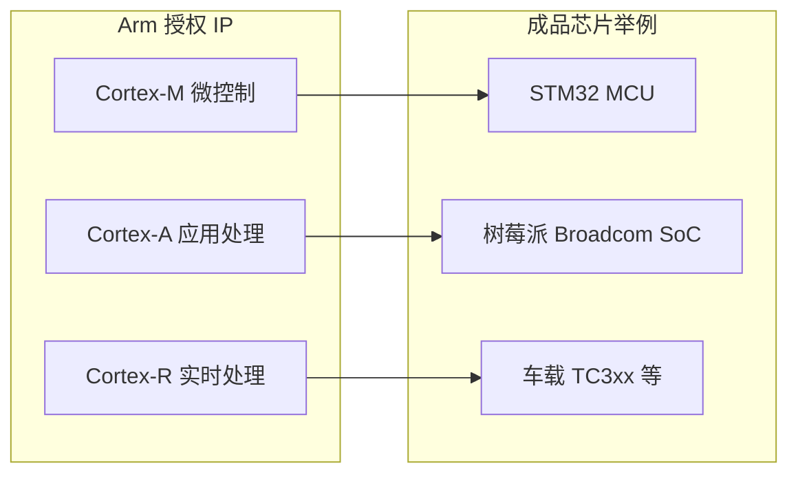

# ARM 处理器系列说明

> **相关文档**  
> - [文件说明.md](./文件说明.md) — Embedded 目录索引  
> - [STM32最小系统板与面包板器件说明.md](./STM32最小系统板与面包板器件说明.md) — 蓝 pill 使用 **Cortex-M3**  
> - [STM32嵌入式学习路线与能力规划.md](./STM32嵌入式学习路线与能力规划.md) — 以 STM32（Cortex-M）为主的学习路线  
> - [../DeviceAccess/Modbus/MCU与UART说明.md](../DeviceAccess/Modbus/MCU与UART说明.md) — MCU 在本项目设备中的角色  
> - [../DeviceAccess/Network/无线通信方式说明.md](../DeviceAccess/Network/无线通信方式说明.md) — 模组与 MCU 分工

更新时间：2026-07-12

---

## 一、一句话理解

**ARM**（现 Arm Ltd.）主要做 **CPU 架构与内核 IP 授权**，本身 **不量产成品芯片**。  
海思、高通、苹果、**意法半导体（ST）**、NXP 等厂商购买授权后，把 **Cortex 内核** 与自己的 Flash、外设、封装集成成 **MCU / SoC**。

物联网设备里最常见的是 **Cortex-M**（单片机，如 STM32）；网关、工控机、手机则常见 **Cortex-A**。

```text
Arm 公司     →  设计 Cortex-M3 等「内核图纸」
ST / NXP …   →  做成 STM32F103、GD32 等「能买的芯片」
你           →  买开发板，写 C 固件
```

**记忆口诀**：**ARM 定架构，芯片厂做成品；学 STM32 = 学 Cortex-M + ST 外设。**

---

## 二、Cortex 三大系列总览

| 系列 | 定位 | 典型系统 | 常见操作系统 | 与本项目 |
|------|------|----------|--------------|----------|
| **Cortex-M** | **微控制器** 内核 | STM32、GD32、nRF52 | 裸机 / FreeRTOS | ★★★ **设备 MCU 主战场** |
| **Cortex-A** | **应用处理器** 内核 | 树莓派、手机 SoC、i.MX | Linux / Android | 网关、边缘服务器可选 |
| **Cortex-R** | **实时处理器** 内核 | 汽车 ECU、工业伺服 | RTOS / 裸机 | 高可靠控制，项目内较少直接接触 |



---

## 三、Cortex-M 系列（MCU，本项目核心）

### 3.1 是什么

**Cortex-M** 面向 **微控制器**：片上 Flash/RAM、中断响应快、功耗低、无 MMU（多数型号），适合传感器、电机控制、通信模组伴侣 MCU。

你手里的 **STM32F103C8T6** 内核为 **Cortex-M3**。

### 3.2 常见型号对照

| 内核 | 推出年代 | 特点 | 代表芯片 / 板子 |
|------|----------|------|-----------------|
| **Cortex-M0 / M0+** | 2009 / 2012 | 面积最小、功耗极低、指令集精简 | STM32F0、STM32L0、部分低成本 IoT |
| **Cortex-M3** | 2004 | 经典 32 位 MCU，性价比高 | **STM32F103（蓝 pill）**、STM32F1 全系 |
| **Cortex-M4** | 2010 | 在 M3 基础上加 **DSP** 与可选 **FPU**（浮点） | STM32F4、STM32G4、nRF52840 |
| **Cortex-M7** | 2014 | 高性能、Cache、更强 DSP/FPU | STM32F7、STM32H7 |
| **Cortex-M23** | 2016 | 基于 M0+，加强 **TrustZone** 安全 | 部分 STM32L5 入门安全款 |
| **Cortex-M33** | 2016 | 带 **TrustZone**、DSP、可选 FPU | STM32L5、STM32U5、nRF5340 |
| **Cortex-M55** | 2020 | 引入 **Helium**（MVE 向量扩展），AI/信号处理 | STM32U5 部分、新 IoT SoC |
| **Cortex-M85** | 2022 | 当前旗舰 M 系列，性能最高 | 新一代高端 MCU |

### 3.3 选型记忆（物联网场景）

| 需求 | 建议内核档 |
|------|------------|
| 学习入门、闸门采集、MQTT+Modbus | **M3 / M4** 足够 |
| 大量浮点运算、电机 FOC | **M4F / M7**（带 FPU） |
| 电池供电、极简传感器 | **M0+**（L0/U0 等） |
| 安全启动、加密、防篡改 | **M33 / M23**（TrustZone） |
| 边缘 AI、音频处理 | **M55** 及以上 |

### 3.4 与本项目

| 角色 | 典型芯片 | 做什么 |
|------|----------|--------|
| **设备主控 MCU** | STM32F1/F4/GD32（Cortex-M3/M4） | 采集、协议、驱动模组、BLE UART |
| **通信模组内** | 常为 **Cortex-M 或更高** 隐藏内核 | ESP8266/ESP32、4G 模组内部已跑固件 |
| **平台服务器** | x86 / 云主机（非 Cortex-M） | Admin.NET、Gateway、RabbitMQ |

学 [STM32短期入门规划.md](./STM32短期入门规划.md) 即在学习 **Cortex-M3 + ST 外设库（HAL）**。

---

## 四、Cortex-A 系列（应用处理器）

### 4.1 是什么

**Cortex-A** 面向 **智能手机、平板、嵌入式 Linux、网关**：带 **MMU**、可跑 **Linux / Android**，主频 GHz 级，外接 DDR 与 eMMC。

### 4.2 常见型号（按代际简化）

| 档位 | 代表内核 | 特点 | 常见场景 |
|------|----------|------|----------|
| 入门 | **A5、A7、A32** | 低功耗、多核小核 | 工业 HMI、低端平板 |
| 主流 | **A53、A55** | 高能效多核 | 树莓派 3/4、机顶盒、网关 |
| 性能 | **A72、A73、A76、A78** | 高性能大核 | 手机主核、边缘 AI 盒子 |
| 旗舰 | **X1 / X2 / X3 / X4**（Cortex-X） | 峰值性能 | 旗舰手机「超大核」 |

同一颗手机 SoC 常为 **「Cortex-X + A7xx 大核 + A5xx 小核」** 大小核组合（Arm **big.LITTLE** / **DynamIQ** 架构）。

### 4.3 与本项目

| 场景 | 是否用 Cortex-A |
|------|-----------------|
| 现场采集仪 MCU | ❌ 一般用 **Cortex-M** |
| 站房 **IoT 网关**（跑 Linux + Docker + Node-RED） | ✅ 树莓派、RK3568 等 |
| 本平台 **云端 / 机房服务器** | 多为 **x86_64**，与 Arm 无直接关系 |
| uni-app 手机 App | 跑在手机 **Cortex-A** 上，与你写的 MCU 固件分层 |

**记忆**：**Cortex-A 跑 Linux；Cortex-M 跑你的 `while(1)` 固件。**

---

## 五、Cortex-R 系列（实时处理器）

### 5.1 是什么

**Cortex-R** 面向 **硬实时、高可靠**：汽车制动/转向、工业伺服、存储控制器。强调 **确定性中断延迟**、锁步核、ECC 内存等。

### 5.2 常见型号

| 内核 | 特点 | 场景 |
|------|------|------|
| **Cortex-R4 / R5** | 经典实时核 | 汽车、工业 longstanding |
| **Cortex-R52** | 支持虚拟化、功能安全 | ADAS、域控制器 |
| **Cortex-R82** | 面向存储与更高性能实时 | SSD 控制器等 |

### 5.3 与本项目

水务闸门、灌区采集 **通常用 Cortex-M 即可**；若涉及 **功能安全认证（ISO 26262 / IEC 61508）** 的特种执行机构，方案层可能见到 **Cortex-R**，一般研发人员无需首学。

---

## 六、其他 Arm 相关产品线（了解即可）

| 名称 | 定位 |
|------|------|
| **SecurCore** | 安全支付、SIM 卡、加密芯片内核 |
| **Ethos-U / Ethos-N** | 端侧 **NPU** AI 加速，常与 Cortex-M/A 搭配 |
| **Neoverse** | **数据中心 / 5G 基站** CPU 内核（非 MCU） |
| **Mali GPU** | 图形处理器 IP（手机 GPU 常见） |

---

## 七、架构代际与指令集（ARMv6～ARMv8）

| 架构 | 关联内核 | 说明 |
|------|----------|------|
| **ARMv6-M / v7-M** | Cortex-M0/M3/M4/M7 | **STM32F1/F4** 等常用 **Thumb-2** 指令 |
| **ARMv8-M** | Cortex-M23/M33/M55/M85 | 加强安全、可选 TrustZone |
| **ARMv7-A** | 早期 Cortex-A | 32 位 Linux |
| **ARMv8-A** | 现代 Cortex-A | **AArch64**（64 位）+ 兼容 32 位 |
| **ARMv9-A** | 最新一代 A/X 系列 | 面向 AI 与安全增强 |

**学习 STM32F103 时**：知道属于 **ARMv7-M + Cortex-M3** 即可；编译器生成 **Thumb** 代码。

---

## 八、「ARM 芯片」与常见厂商对应

Arm 授权后，各厂商品名不同：

| 厂商 | 常见系列 | Arm 内核 | 备注 |
|------|----------|----------|------|
| **意法半导体 ST** | STM32F/L/G/H/U | Cortex-M0+～M7 | 本项目学习主选 |
| **兆易创新 GigaDevice** | GD32 | 多为 Cortex-M3/M4 | 国产，用法接近 STM32 |
| **沁恒 WCH** | CH32 | Cortex-M3/M4 等 | 国产，RISC-V 线亦有 |
| **NXP** | Kinetis、LPC、i.MX | M 系 / A 系 | 工业与车载 |
| **Microchip** | SAM | Cortex-M0+～M7 | 原 Atmel 线 |
| **Nordic** | nRF52/nRF53 | Cortex-M4/M33 | **BLE** 很强 |
| **Espressif** | ESP32 系列 | **Xtensa / RISC-V**（非 Cortex-M） | Wi-Fi/BLE 模组常见 |
| **高通 Qualcomm** | 骁龙 | Cortex-A + 自研 / Arm X 系列 | 手机 |
| **苹果 Apple** | A 系列 / M 系列 | Cortex-A 衍生定制 | iPhone、Mac |
| **树莓派** | BCM2xxx/27xx | Cortex-A | 边缘 Linux |

**注意**：**ESP32 不是 Cortex-M**，但可作为 **Wi-Fi 通信模组** 挂在 **Cortex-M STM32** 旁，见 [无线通信方式说明.md](../DeviceAccess/Network/无线通信方式说明.md)。

---

## 九、Cortex-M vs Cortex-A 快速对比

| 维度 | Cortex-M（如 STM32） | Cortex-A（如树莓派） |
|------|----------------------|----------------------|
| 典型主频 | 几十～几百 MHz | 1～3 GHz |
| 内存 | 片上 KB～MB 级 SRAM/Flash | 外接 GB 级 DDR |
| MMU | 通常无（M7 等有可选 MPU） | 有，跑 Linux 必需 |
| 启动 | 复位后直接跑 Flash 向量表 | Bootloader → Linux 内核 |
| 开发 | C + HAL / RTOS | Linux 应用、Python、Docker |
| 功耗 | 低，适合电池 | 较高，常插电 |
| 本项目设备侧 | **主控** | 可选 **边缘网关** |

---

## 十、学习路线建议（结合本项目）

```text
第 1 阶段（当前）
  Cortex-M3 + STM32F103
  → GPIO / UART / I2C / 定时器
  → 见 STM32短期入门规划.md

第 2 阶段
  仍属 Cortex-M：MQTT、Modbus、FreeRTOS
  → 见 STM32嵌入式学习路线与能力规划.md

第 3 阶段（可选拓展）
  Cortex-M4F 浮点 / STM32F4
  或 Cortex-A：树莓派上跑 Gateway 旁路服务

不必首学
  Cortex-R、Cortex-A 手机 SoC 细节、ARMv9 架构手册
```

| 目标 | 推荐聚焦 |
|------|----------|
| 能改设备固件、联调本平台 | **Cortex-M3/M4** + HAL |
| 能选下一款量产 MCU | 对照 §3.2 看 Flash/RAM/外设，不必追最新 M85 |
| 能做边缘 Linux 网关 | 补 **Cortex-A + Linux**，与 MCU 分工 |

---

## 十一、自检问答

1. ARM 公司卖的是成品 STM32 吗？  
   → **不是**；卖 **IP 授权**，STM32 是 **ST** 的产品。  

2. 蓝 pill 用的什么内核？  
   → **Cortex-M3**。  

3. 树莓派和 STM32 为何开发方式差很多？  
   → 树莓派是 **Cortex-A + Linux**；STM32 是 **Cortex-M 裸机/RTOS**。  

4. ESP32 是 Cortex-M 吗？  
   → **不是**（多为 Xtensa / RISC-V）；作通信模组与 STM32 配合即可。  

5. 本项目设备 MCU 应优先哪条线？  
   → **Cortex-M**（STM32 / GD32 等），通信模组内部架构可暂不深挖。  

---

## 十二、参考链接

| 主题 | URL |
|------|-----|
| Arm 产品与 Cortex 总览 | https://www.arm.com/products/silicon-ip-cpu |
| Cortex-M 文档入口 | https://developer.arm.com/Processors/Cortex-M |
| Cortex-A 文档入口 | https://developer.arm.com/Processors/Cortex-A |
| Cortex-R 文档入口 | https://developer.arm.com/Processors/Cortex-R |
| STM32 与 Cortex 对应 | https://www.st.com/en/microcontrollers-microprocessors.html |
| 本项目 STM32 学习 | [STM32嵌入式学习路线与能力规划.md](./STM32嵌入式学习路线与能力规划.md) |
