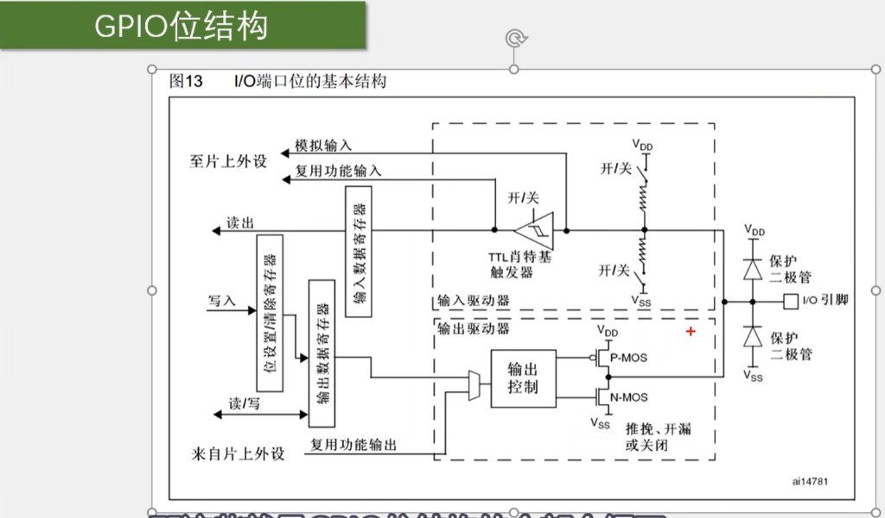
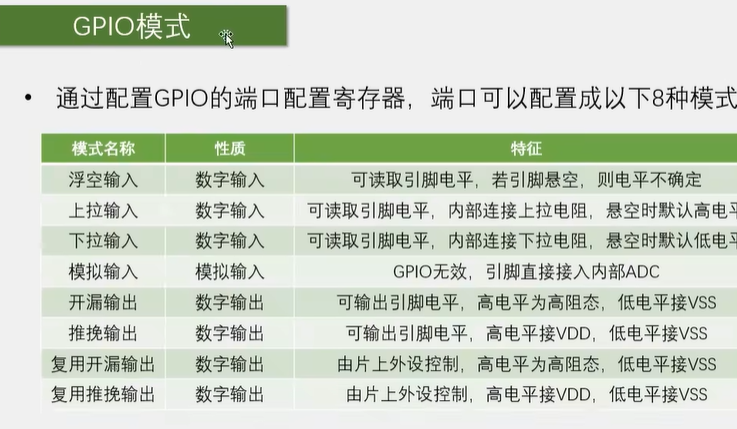

# STM32 GPIO 说明

> **相关文档**  
> - [文件说明.md](./文件说明.md) — Embedded 目录索引  
> - [STM32外设说明.md](./STM32外设说明.md) — 外设总览（GPIO 见 §4.2）  
> - [STM32F103C8T6引脚说明.md](./STM32F103C8T6引脚说明.md) — 引脚与复用功能  
> - [STM32入门环境与工程配置备忘.md](./STM32入门环境与工程配置备忘.md) — Keil / SPL 工程配置  
> - [STM32最小系统板与面包板器件说明.md](./STM32最小系统板与面包板器件说明.md) — LED、蜂鸣器等接线对象

更新时间：2026-07-13

---

## 一、一句话理解

**GPIO**（General Purpose Input/Output）是 STM32 每个引脚的工作方式开关：同一物理引脚，可配置为 **数字输入、数字输出、模拟输入或复用外设**，内部由 **寄存器 +  MOS 驱动 + 施密特触发器** 等电路实现。

**记忆口诀**：**输入读 IDR，输出写 ODR/BSRR；推挽能拉高拉低，开漏只拉低要外挂；复用交给外设，模拟直通 ADC。**

---

## 二、I/O 端口位的基本结构

下图对应 RM0008 参考手册 **图 13：I/O 端口位的基本结构**（单个引脚内部电路）。



### 2.1 引脚与保护

| 模块 | 说明 |
|------|------|
| **I/O 引脚** | 芯片封装上的物理引脚，连面包板 / 模块 |
| **保护二极管** | 接 `$V_{DD}$` 与 `$V_{SS}$`，抑制 ESD、过压/欠压，保护内部电路 |

### 2.2 输入路径（上半部分）

| 模块 | 说明 |
|------|------|
| **上拉 / 下拉电阻** | 开关可 **开/关**；配置为带上拉/下拉输入时，悬空引脚有默认电平 |
| **TTL 施密特触发器** | 把引脚电压整形为稳定 **0/1**；可开关，关闭时数字输入路径断开 |
| **输入数据寄存器 IDR** | CPU **读出** 当前引脚数字电平 |
| **模拟输入** | 绕过数字逻辑，信号 **直通片上外设**（如 **ADC**） |
| **复用功能输入** | 引脚交给 **USART RX、SPI MISO、TIM 捕获** 等外设读入 |

### 2.3 输出路径（下半部分）

| 模块 | 说明 |
|------|------|
| **位设置/清除寄存器 BSRR** | CPU **写入** 时可单独置位/清零 ODR 某一位，避免读-改-写竞争 |
| **输出数据寄存器 ODR** | 保存待输出电平；可读可写 |
| **输出模式选择** | **推挽**：P-MOS + N-MOS 主动拉高/拉低；**开漏**：仅 N-MOS 拉低，高电平为高阻；**关闭**：两管截止（高阻） |
| **复用功能输出** | 由 **定时器 PWM、USART TX** 等外设驱动，不经 CPU 直接写 ODR |
| **输出控制** | 根据配置寄存器选择 **GPIO 输出** 还是 **复用输出**，以及推挽/开漏 |

### 2.4 与写代码的对应关系

| 你在代码里做的事 | 对应硬件 |
|------------------|----------|
| `GPIO_Init()` 选模式 | 配置上下拉、推挽/开漏、复用/模拟开关 |
| `GPIO_SetBits()` / `BSRR` | 写 **BSRR** 置位 ODR |
| `GPIO_ResetBits()` / `BRR` | 写 **BRR** 或 BSRR 高 16 位清零 |
| `GPIO_ReadInputDataBit()` | 读 **IDR** |
| `TIM_PWM` 输出到引脚 | **复用功能输出** 路径 |
| `ADC` 采样 PA0 | **模拟输入** 路径，GPIO 数字部分无效 |

---

## 三、GPIO 八种模式

通过配置 **端口配置寄存器 CRH/CRL**（每引脚 4 bit 模式位），每个 I/O 可设为下列 **8 种模式之一**：



### 3.1 四种输入模式

| 模式名称 | 性质 | 特征 | 典型用途 |
|----------|------|------|----------|
| **浮空输入** | 数字输入 | 可读电平；悬空时电平 **不确定** | 外接已有明确驱动源的 DO |
| **上拉输入** | 数字输入 | 内部上拉；悬空时 **默认高** | 按键一端接 GND、一端接 IO（按下为低） |
| **下拉输入** | 数字输入 | 内部下拉；悬空时 **默认低** | 按键一端接 3.3V、按下为高 |
| **模拟输入** | 模拟输入 | **GPIO 数字逻辑关闭**；引脚直连 **ADC** | 光敏/声音模块 **AO**、电位器 |

### 3.2 四种输出模式

| 模式名称 | 性质 | 特征 | 典型用途 |
|----------|------|------|----------|
| **开漏输出** | 数字输出 | 低电平接 `$V_{SS}$`；高电平 **高阻**（需外部上拉） | I2C 总线、5 V 容忍开漏场景 |
| **推挽输出** | 数字输出 | 高接 `$V_{DD}$`，低接 `$V_{SS}$`，可主动驱动 | **LED、蜂鸣器 IN**（入门最常用） |
| **复用开漏输出** | 数字输出 | 由 **片上外设** 控制；高阻 / 拉低 | I2C1 SCL/SDA（硬件 I2C） |
| **复用推挽输出** | 数字输出 | 由 **片上外设** 控制；高 `$V_{DD}$` / 低 `$V_{SS}$` | **USART TX、SPI、TIM PWM** |

### 3.3 模式怎么选（入门套件）

| 接什么 | 推荐模式 |
|--------|----------|
| 板载 / 外接 LED | **推挽输出** |
| 有源蜂鸣器模块 IN | **推挽输出** |
| 轻触按键（一脚 GND） | **上拉输入** |
| 传感器模块 DO | **浮空输入** 或 **上拉输入**（视模块输出类型） |
| 传感器 AO → PA0 | **模拟输入** |
| OLED I2C（PB6/PB7） | **复用开漏**（库函数 / Cube 配置为 AF_OD） |
| USB-TTL 串口 TX/RX | **复用推挽**（USART1） |
| 舵机 PWM | **复用推挽**（TIM 通道） |

---

## 四、标准外设库中的写法（SPL）

配置 GPIO 时，`GPIO_InitTypeDef` 里的 **Mode** 与 **Pin** 即对应上图八种模式：

```c
GPIO_InitTypeDef GPIO_InitStructure;

RCC_APB2PeriphClockCmd(RCC_APB2Periph_GPIOC, ENABLE);   // 先开 GPIOC 时钟

GPIO_InitStructure.GPIO_Pin = GPIO_Pin_13;
GPIO_InitStructure.GPIO_Mode = GPIO_Mode_Out_PP;        // 推挽输出
GPIO_InitStructure.GPIO_Speed = GPIO_Speed_50MHz;
GPIO_Init(GPIOC, &GPIO_InitStructure);

GPIO_SetBits(GPIOC, GPIO_Pin_13);    // 高电平
GPIO_ResetBits(GPIOC, GPIO_Pin_13);  // 低电平
```

| `GPIO_Mode` 常量 | 对应模式 |
|------------------|----------|
| `GPIO_Mode_IN_FLOATING` | 浮空输入 |
| `GPIO_Mode_IPU` | 上拉输入 |
| `GPIO_Mode_IPD` | 下拉输入 |
| `GPIO_Mode_AIN` | 模拟输入 |
| `GPIO_Mode_Out_OD` | 开漏输出 |
| `GPIO_Mode_Out_PP` | 推挽输出 |
| `GPIO_Mode_AF_OD` | 复用开漏 |
| `GPIO_Mode_AF_PP` | 复用推挽 |

### 4.1 直接写寄存器（教程早期写法）

不经过库函数时，典型步骤与结构图一致：

1. **RCC_APB2ENR** 使能对应 GPIO 端口时钟（如 GPIOC → **IOPCEN**）  
2. **GPIOC_CRH / CRL** 配置 PC13 的模式与速度（4 bit × 引脚）  
3. **GPIOC_ODR** 或 **BSRR** 写输出电平  

示例（PC13 推挽输出、置高）：

```c
RCC->APB2ENR |= RCC_APB2ENR_IOPCEN;
GPIOC->CRH &= ~(0xF << 20);
GPIOC->CRH |=  (0x3 << 20);   // MODE=11 输出 50MHz，CNF=00 推挽（以手册位定义为准）
GPIOC->BSRR = GPIO_BSRR_BS13; // 置位 PC13
```

具体位域以 [RM0008](https://www.st.com/resource/en/reference_manual/rm0008-stm32f101xx-stm32f102xx-stm32f103xx-stm32f105xx-and-stm32f107xx-advanced-armbased-32bit-mcus-stmicroelectronics.pdf) **GPIO 章节** 为准。

---

## 五、推挽 vs 开漏（易混）

```text
推挽输出 (Push-Pull)
  输出 1 → P-MOS 导通 → 引脚接 VDD
  输出 0 → N-MOS 导通 → 引脚接 VSS
  → 可主动驱动 LED、蜂鸣器

开漏输出 (Open-Drain)
  输出 0 → N-MOS 导通 → 引脚接 VSS
  输出 1 → 两管截止 → 高阻，需外部上拉才变高
  → I2C 多设备共线、电平转换
```

---

## 六、与本项目 / 套件对照

| 场景 | GPIO 模式 | 引脚示例（蓝 pill） |
|------|-----------|---------------------|
| 板载 LED | 推挽输出 | PC13 |
| 外接 LED + 限流电阻 | 推挽输出 | PB12、PA0 等 |
| 蜂鸣器模块 | 推挽输出 | PB12 |
| 按键 | 上拉输入 | PB0 |
| 传感器 DO | 浮空/上拉输入 | 任意 PA/PB |
| 传感器 AO | 模拟输入 | PA0～PA7 |
| OLED | 复用开漏（I2C） | PB6 SCL、PB7 SDA |
| 串口调试 | 复用推挽（USART） | PA9 TX、PA10 RX |

详见 [STM32外设说明.md](./STM32外设说明.md) §4.2、[STM32最小系统板与面包板器件说明.md](./STM32最小系统板与面包板器件说明.md) §四。

---

## 七、自检问答

1. CPU 读引脚输入电平读哪个寄存器？  
   → **IDR（输入数据寄存器）**。

2. 点灯一般用推挽还是开漏？  
   → **推挽输出**。

3. I2C 为什么用复用开漏？  
   → 多主机/多从机 **线与**，高电平靠 **外部上拉**，不会冲突。

4. ADC 采样时 GPIO 应设什么模式？  
   → **模拟输入**；数字施密特触发器关闭。

5. `GPIO_SetBits` 底层常写哪个寄存器？  
   → **BSRR** 低 16 位（置位）。

---

## 八、延伸阅读

| 资料 | 内容 |
|------|------|
| RM0008 §General-purpose and alternate-function I/Os | 图 13 位结构、CRL/CRH、IDR/ODR/BSRR |
| SPL `stm32f10x_gpio.c` / `.h` | `GPIO_Init` 与八种模式枚举 |
| [STM32入门环境与工程配置备忘.md](./STM32入门环境与工程配置备忘.md) | Define、Include Path、库文件加入工程 |
