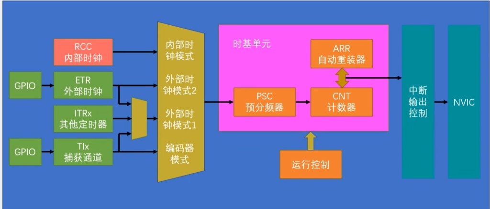
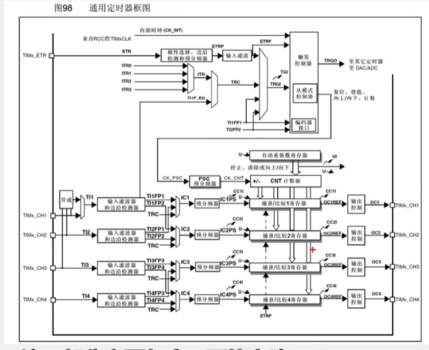
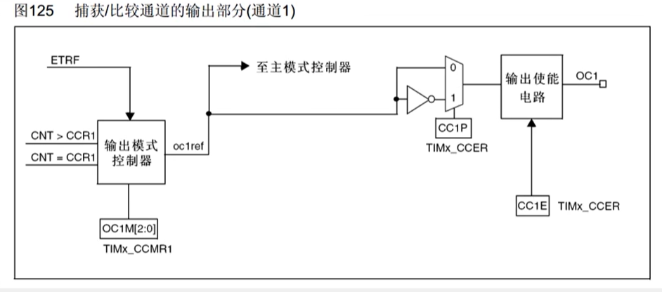
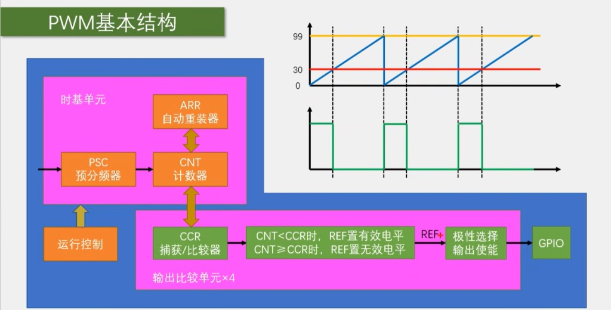
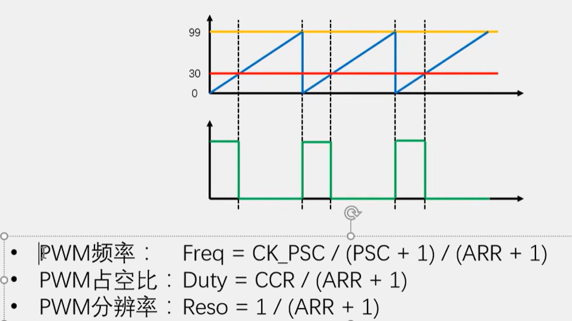
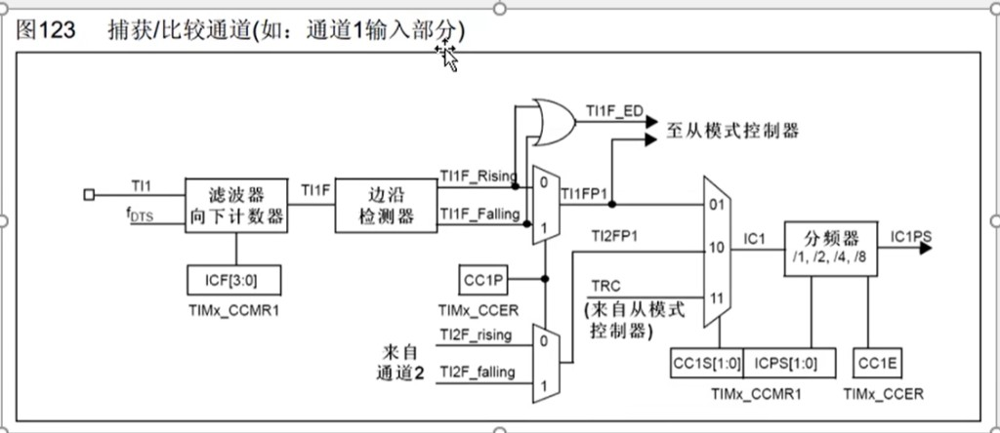
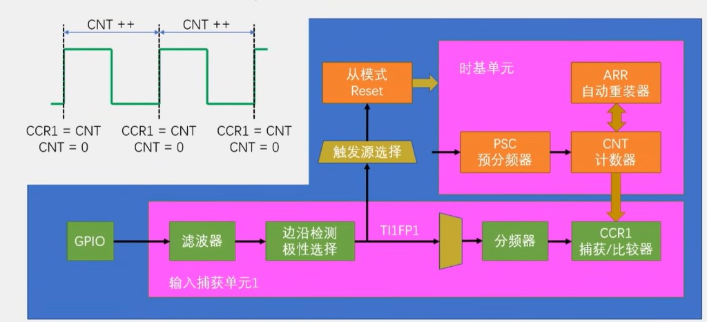
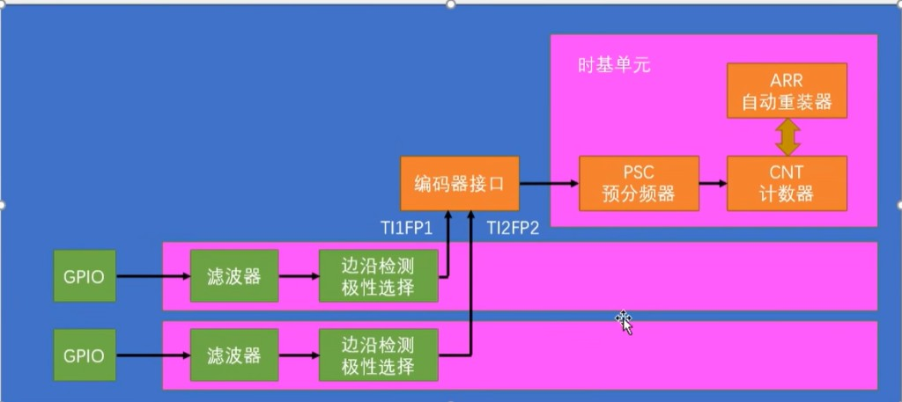
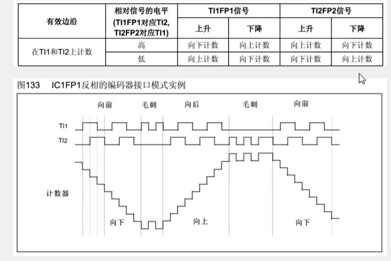
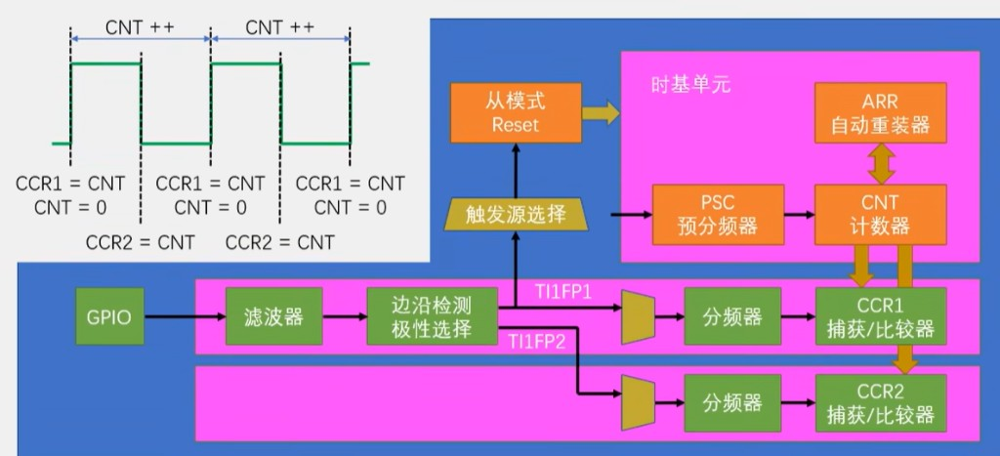

# STM32 定时器 Timer 说明

> **相关文档**
>
> - [文件说明.md](./文件说明.md) — Embedded 目录索引
> - [STM32外设说明.md](./STM32外设说明.md) — TIM 外设总览 §6.2
> - [STM32-中断与外部中断说明.md](./STM32-中断与外部中断说明.md) — NVIC / IRQHandler
> - [STM32-GPIO说明.md](./STM32-GPIO说明.md) — 复用推挽（PWM）、上拉输入（捕获）
> - [STM32F103C8T6引脚说明.md](./STM32F103C8T6引脚说明.md) — TIMx 通道引脚
> - 工程示例：[Timer.c](../project/System/Timer.c)、[PWM.c](../project/Hardware/PWM.c)、[Encoder2.c](../project/Hardware/Encoder2.c)

更新时间：2026-07-14

---

## 一、定时器总览

**定时器（Timer / TIM）** 是芯片内的 **硬件计数器**：用时钟驱动计数器走数，到设定条件后产生更新、比较输出、捕获等动作，几乎不占 CPU。

| 类型 | 举例 | 特点 |
|------|------|------|
| **基本定时器** | TIM6、TIM7 | 只做时基；无 GPIO 通道 |
| **通用定时器** | TIM2～TIM5 | 时基 + PWM + 输入捕获 + 编码器接口 |
| **高级定时器** | TIM1、TIM8 | 通用能力 + 死区、互补输出，适合电机 |

本工程入门多用 **TIM2 / TIM3**。

### 1.1 时基单元（一切功能的底座）

无论后面做中断、PWM 还是捕获，都先经过时基三件套：

| 概念 | 简称 | 英文全称 | 作用 |
|------|------|----------|------|
| 预分频器 | **PSC** | Prescaler | 输入时钟先除频：`CK_CNT = CK_PSC / (PSC+1)` |
| 自动重装载 | **ARR** | Auto-Reload Register | 向上计数：CNT 从 0 计到 ARR 后溢出并重装 |
| 计数器 | **CNT** | Counter | 当前计数值 |

**定时时间**（向上计数、**内部时钟**；`f_CK` 为定时器计数时钟，F103 常见 72 MHz）：

```text
T = (PSC + 1) × (ARR + 1) / f_CK
```

例：`PSC = 72-1`，`ARR = 1000-1`，`f_CK = 72 MHz`

```text
T = 72 × 1000 / 72_000_000 = 1 ms
```

寄存器里写的是「实际分频/周期 − 1」，所以公式里都要 **+1**。





### 1.2 推荐阅读顺序

先弄清「谁给 CNT 打拍」，再谈中断与通道功能：

| 顺序 | 章节 | 解决什么问题 |
|------|------|--------------|
| 1 | **二、时钟源** | CNT 的拍从内部来还是外部脉冲来 |
| 2 | **三、定时中断** | 计满 ARR 后如何周期性进中断 |
| 3 | **四、OC / PWM** | 如何往外吐波形、调占空比 |
| 4 | **五、IC** | 如何往里量脉宽 / 频率 / 编码器 |

**记忆口诀**：**PSC/ARR 定快慢；时钟源定打拍从哪来；更新中断做节拍；OC 往外吐，IC 往里量。**

```text
时钟源 ──► 时基(PSC/ARR/CNT) ──┬──► 更新中断
                              ├──► 输出比较 / PWM
                              └──► 输入捕获 / 编码器
```

---

## 二、内外时钟源选择

### 2.1 定义

**时钟源**：决定 **CNT 每一次加一的「拍」从哪来**。时基的 PSC/ARR 只决定「数多少拍算一轮」；先选定时钟源，再配时基。

| 时钟源 | 拍从哪来 | 典型用途 |
|--------|----------|----------|
| **内部时钟** | APB 分频后的定时器时钟（F103 常见 72 MHz） | 毫秒定时、PWM、舵机 |
| **外部时钟模式 1** | 通道脚 TIx 边沿 | 外部脉冲计数 |
| **外部时钟模式 2** | **ETR** 引脚脉冲 | 对射管、简易脉冲计数（本工程 `Timer.c`） |
| **内部触发 ITR** | 别的定时器触发 | 级联同步（进阶） |

### 2.2 工作流程

**内部时钟**

```text
APB 定时器时钟 CK_INT
    → TIM_InternalClockConfig（多数例程可省略，上电默认内部）
    → 经 PSC 得到 CK_CNT
    → 驱动 CNT，到 ARR 更新
```

**外部时钟模式 2（ETR）**

```text
外部脉冲 → GPIO（输入）→ ETR
    → TIM_ETRClockMode2Config（预分频 / 极性 / 滤波）
    → 每来一个有效脉冲，CNT +1
    → 计满 ARR → 更新事件（可进中断）
```

| 需求 | 选 |
|------|----|
| 固定时间间隔（1 ms、1 s） | **内部时钟** + 算好 PSC/ARR |
| 数外部脉冲、脉冲满 N 次做事 | **外部时钟** + ARR = N−1 |
| PWM / 舵机 | **内部时钟** + OC（第四章） |

### 2.3 函数

| 函数 | 作用 |
|------|------|
| `TIM_InternalClockConfig` | 选内部时钟 |
| `TIM_ETRClockMode2Config` | 外部时钟模式 2（ETR） |
| `TIM_TIxExternalClockConfig` | 外部时钟模式 1（通道作时钟） |
| `TIM_ITRxExternalClockConfig` | 内部触发作时钟（级联） |
| `GPIO_Init`（输入） | 外部脉冲脚 |
| `TIM_GetCounter` | 读当前计数值（外部时钟下即脉冲累计） |

内部时钟示例：

```c
TIM_InternalClockConfig(TIM2);
TIM_TimeBaseInitStructure.TIM_Prescaler = 72 - 1;   // PSC
TIM_TimeBaseInitStructure.TIM_Period = 1000 - 1;    // ARR → 1 ms @ 72 MHz
TIM_TimeBaseInit(TIM2, &TIM_TimeBaseInitStructure);
```

外部时钟示例（与 [Timer.c](../project/System/Timer.c) 一致）：

```c
/* PA0 上拉输入 … */
TIM_ETRClockMode2Config(TIM2, TIM_ExtTRGPSC_OFF,
                        TIM_ExtTRGPolarity_NonInverted, 0x00);
TIM_TimeBaseInitStructure.TIM_Prescaler = 1 - 1;
TIM_TimeBaseInitStructure.TIM_Period = 10 - 1;      // 每 10 个外部脉冲更新一次
```

### 2.4 应用

| 应用 | 时钟源 | 说明 |
|------|--------|------|
| 毫秒调度、PWM | 内部 | 时间与系统时钟挂钩，可精确计算 |
| 光电门 / 脉冲计数 | 外部 ETR 或 TI | CNT 反映脉冲个数 |
| 计满 N 脉冲再中断 | 外部 + ARR=N−1 + 更新中断 | 少用软件轮询 |
| 简易测频 | 固定时间窗内读 CNT 增量 | 时间窗用另一个**内部**定时器 |

**注意**：机械开关脉冲宜加滤波或消抖；外部时钟下「定时中断」表示的是 **脉冲个数到点**，不是墙上时钟的 1 ms。

---

## 三、定时中断

### 3.1 定义

**定时中断**：计数器产生 **更新事件（UEV）**（向上计数时即 CNT 溢出到 ARR）后，向 NVIC 请求中断，CPU 进入 `TIMx_IRQHandler`。

| | 空循环 `delay` | 定时中断 |
|--|----------------|----------|
| CPU | 空转等待 | 中断才处理，其余时间可干别的 |
| 触发含义 | 软延时 | **更新事件**（内部时钟≈时间到；外部时钟≈脉冲数到） |
| 典型用途 | 临时调通 | 1 ms 节拍、心跳、采样调度 |

和 EXTI 按键中断的区别：EXTI 看 **GPIO 边沿**；定时中断看 **计数更新**（外部时钟时，边沿是间接通过「给 CNT 打拍」体现的）。

### 3.2 工作流程

```text
1 打开 TIMx 外设时钟
2 选择时钟源（内部 / 外部，见第二章）
3 配置时基单元（PSC、ARR、计数模式）
4 清更新标志（避免一启动就进中断）
5 使能更新中断 TIM_IT_Update + 配置 NVIC
6 TIM_Cmd(ENABLE) 启动
   → CNT 到 ARR → 更新 → TIMx_IRQHandler
   → 判标志 → 做事 → 清挂起位 → 返回
```

**务必分清两种范例**：

| 目标 | 时钟源 | 工程参考 |
|------|--------|----------|
| 固定时间节拍（如 1 ms） | 内部时钟 | 按第二章内部时钟公式自配 + 本章中断步骤 |
| 外部脉冲计满再中断 | 外部时钟模式 2 | [Timer.c](../project/System/Timer.c)（ETR + ARR=10−1） |

不要把 `Timer.c` 当成「内部 1 ms 定时」模板——它当前是 **外部脉冲计数 + 更新中断**。

### 3.3 函数

| 函数 | 作用 |
|------|------|
| `RCC_APBxPeriphClockCmd` | 打开 TIMx 时钟 |
| `TIM_InternalClockConfig` / `TIM_ETRClockMode2Config` | 选时钟源 |
| `TIM_TimeBaseInit` | 配置 PSC、ARR、计数模式 |
| `TIM_ClearFlag` / `TIM_ClearITPendingBit` | 清更新标志 / 中断挂起位 |
| `TIM_ITConfig(..., TIM_IT_Update, ENABLE)` | 使能更新中断 |
| `NVIC_Init` | 配置 `TIMx_IRQn` |
| `TIM_Cmd` | 启动 / 停止 |
| `TIM_GetITStatus` | IRQ 内判断是否更新中断 |
| `TIM_GetCounter` / `TIM_SetCounter` | 读 / 写 CNT |

```c
void TIM2_IRQHandler(void)
{
    if (TIM_GetITStatus(TIM2, TIM_IT_Update) == SET)
    {
        /* 置标志、加计数等，保持简短 */
        TIM_ClearITPendingBit(TIM2, TIM_IT_Update);
    }
}
```

### 3.4 应用

| 场景 | 说明 |
|------|------|
| **1 ms / 1 s 节拍** | 非阻塞闪灯、采集调度（内部时钟） |
| **7段式软件定时器** | 多个倒计时共用同一 1 ms 中断递减 |
| **按键扫描节拍** | 定时消抖 |
| **脉冲满 N 报警** | 外部时钟 + 更新中断 |

**原则**：ISR 里少干活；复杂逻辑放主循环。

---

## 四、输出比较 OC 与 PWM

### 4.1 输出比较 OC

**输出比较（Output Compare）**：通道有比较寄存器 **CCR**。当 CNT 与 CCR 满足比较关系时，硬件自动改引脚电平，或产生比较中断 / DMA。

| 名词 | 英文 | 含义 |
|------|------|------|
| **OCx** | Output Compare channel x | 第 x 路输出比较通道 |
| **CCR** | Capture/Compare Register | 比较值；决定何时改引脚 |



### 4.2 PWM

**PWM**（Pulse Width Modulation，**脉冲宽度调制**）：在固定周期内反复输出高低电平方波，用 **高电平占比（占空比）** 等效调节平均电压 / 能量。

PWM 不是独立外设，而是 OC 的一种模式（`TIM_OCMode_PWM1` / `PWM2`）：

- **PSC + ARR** → 周期 / 频率  
- **CCR** → 脉宽 / 占空比  

```text
一个 PWM 周期
|<------------- T_period ------------>|
|████████░░░░░░░░░░░░░░░░░░░░░░░░░░░░|
 高电平 t_high          低电平
```

| 量 | 英文 | 含义 | 主要由谁定 |
|----|------|------|------------|
| 周期 / 频率 | Period / Frequency | \(f = 1/T\) | PSC、ARR |
| 脉宽 | Pulse Width | 有效电平持续时间 | CCR |
| 占空比 | Duty Cycle | \(t_{high}/T\) | CCR / (ARR+1) |

```text
f_PWM ≈ f_CK / [(PSC+1)×(ARR+1)]
Duty  ≈ CCR / (ARR+1)
```

| 模式 | 含义 |
|------|------|
| **PWM1** | CNT < CCR → 有效电平；CNT ≥ CCR → 无效（极性再定高低） |
| **PWM2** | 有效/无效区间与 PWM1 相反 |

**口诀**：**ARR 定周期，CCR 定脉宽；PWM = 用脉冲宽度调强弱。**





### 4.3 工作流程

课堂常记 **五步**（PWM 与一般 OC 共用；GPIO 时钟可在第 1 步一并打开）：

```text
1 打开外设时钟（TIMx，常一并开 GPIO）
        ↓
2 配置时基单元（内部时钟 + PSC / ARR → 定频率）
        ↓
3 配置输出比较单元
   · CCR（结构体 TIM_Pulse；口误常写成 CRR）
   · 输出比较模式（OCMode，如 PWM1）
   · 极性选择（OCPolarity）
   · 输出使能（OutputState）
        ↓
4 配置 GPIO（通道脚 AF_PP）
        ↓
5 运行控制（TIM_Cmd；之后 SetCompare / 改 PSC）
```

| 步骤 | 关键函数 |
|------|----------|
| 1 开时钟 | `RCC_APBxPeriphClockCmd` |
| 2 时基 | `TIM_InternalClockConfig`、`TIM_TimeBaseInit` |
| 3 OC | `TIM_OCStructInit`、`TIM_OCxInit` |
| 4 GPIO | `GPIO_Init`（`GPIO_Mode_AF_PP`） |
| 5 运行 | `TIM_Cmd`；`TIM_SetComparex` |

高级定时器在启动前还需 `TIM_CtrlPWMOutputs`（MOE）。工程代码里 GPIO 写在 OC 前或后都能出波形；记忆以课堂 **1→5** 为准。

本工程 [PWM.c](../project/Hardware/PWM.c)：`PSC=72-1`，`ARR=20000-1` → 约 **50 Hz**（舵机常用），`TIM_OC3Init` → **PA2**。

### 4.4 函数

| 函数 | 作用 |
|------|------|
| `TIM_OCStructInit` | OC 结构体填默认再改 |
| `TIM_OCxInit` | 初始化通道 x |
| `TIM_OCMode` / `TIM_Pulse` / `TIM_OCPolarity` / `TIM_OutputState` | 模式、CCR、极性、输出使能 |
| `TIM_SetCompare1`～`4` | 运行中改 CCR（占空比） |
| `TIM_OCPreloadConfig` | CCR 预装载，换 duty 更平滑 |
| `TIM_CtrlPWMOutputs` | 高级定时器主输出 |
| `TIM_PrescalerConfig` | 运行中改 PSC（改频率） |

| 本工程封装 | 对应 |
|------------|------|
| `PWM_Init` | 内部时钟 + 时基 + OC3 PWM1 |
| `PWM_SetCompare3` | `TIM_SetCompare3(TIM2, …)` |
| `PWM_SetPrescaler` | `TIM_PrescalerConfig` |

### 4.5 应用

| 应用 | 做法 |
|------|------|
| LED 呼吸灯 | PWM 调占空比 |
| 直流电机调速 | PWM → 驱动板；大电流勿只靠杜邦线 |
| 舵机角度 | 约 50 Hz，脉宽约 0.5～2.5 ms（改 CCR） |
| 无源蜂鸣器音调 | 改 PSC/ARR 改频率，或 50% 方波 |
| 定点翻转波形 | OC Toggle，不必用 PWM |

PWM/OC 输出脚必须是 **复用推挽 AF_PP**，不是普通 `Out_PP`。

---

## 五、输入捕获 IC

### 5.1 定义

**输入捕获（Input Capture）**：选定输入边沿到来时，硬件把当时的 **CNT 锁存进 CCR**，可选进中断。用途：记下「边沿发生在什么时刻」，再算脉宽、周期、频率。

| | 输出比较 OC | 输入捕获 IC |
|--|-------------|-------------|
| 方向 | MCU → 引脚波形 | 引脚事件 → 锁存 CNT |
| CCR | **写**，决定翻转点 | **读**，得到时间戳 |
| GPIO | 复用推挽输出 | 浮空 / 上拉 **输入** |





### 5.2 工作流程

**测脉宽（思路）**

```text
1 开时钟；内部时钟 + 时基（已知 T_tick = (PSC+1)/f_CK）
2 配置 IC：极性、滤波、分频；TIM_ICInit 或 TIM_PWMIConfig
3 配置 GPIO 为输入
4 TIM_Cmd 启动
5 边沿1 → CCR=t1；边沿2 → CCR=t2
6 脉宽 ≈ (t2 − t1) × T_tick   （跨 ARR 溢出须另行累计）
```

**编码器接口**（IC 硬件衍生模式，不是普通「测一次边沿」）：A/B 相接 TI1/TI2，定时器解码方向与脉冲，CNT 表示位置。流程见 [Encoder2.c](../project/Hardware/Encoder2.c)：

```text
GPIO 上拉输入 → IC 滤波 → TIM_EncoderInterfaceConfig → TIM_Cmd
→ 读 TIM_GetCounter 得增量
```







### 5.3 函数

| 函数 | 作用 |
|------|------|
| `TIM_ICStructInit` / `TIM_ICInit` | 单通道输入捕获 |
| `TIM_PWMIConfig` | PWM 输入（周期 + 占空比） |
| `TIM_GetCapture1`～`4` | 读 CCR 锁存值 |
| `TIM_ITConfig(..., TIM_IT_CCx, …)` | 捕获中断 |
| `TIM_EncoderInterfaceConfig` | 编码器接口 |
| `TIM_GetCounter` / `TIM_SetCounter` | 读位置或读完清零 |

```c
void TIM3_IRQHandler(void)
{
    if (TIM_GetITStatus(TIM3, TIM_IT_CC1) == SET)
    {
        uint16_t stamp = TIM_GetCapture1(TIM3);
        /* 算差值、处理溢出… */
        TIM_ClearITPendingBit(TIM3, TIM_IT_CC1);
    }
}
```

### 5.4 应用

| 应用 | 说明 |
|------|------|
| 测频率 / 周期 | 相邻同向边沿的 CCR 差 |
| 测脉宽 | 上升沿、下降沿各捕获一次 |
| 红外遥控 | 测高低电平时间识码 |
| 超声波测距 | 测 Echo 高电平时间 → 距离 |
| 旋转编码器 | 编码器接口；或 GPIO+EXTI 版 |
| 霍尔 / 光电测速 | 周期倒数或单位时间脉冲数 |

1. 捕获间隔超过一个 ARR 周期时必须处理 **CNT 溢出**。  
2. 引脚须是该定时器通道的复用输入。  
3. 同一通道同一时刻不能既做 OC 又做 IC。

---

## 六、与本工程对照

| 能力 | 文件 | 要点 |
|------|------|------|
| 外部时钟 + 更新中断 | `System/Timer.c` | `TIM_ETRClockMode2Config` + `TIM_IT_Update`；**不是**内部 1 ms 模板 |
| PWM（OC） | `Hardware/PWM.c` | 内部时钟；`TIM_OCMode_PWM1`；`TIM_SetComparex` |
| 编码器 | `Hardware/Encoder2.c` | `TIM_EncoderInterfaceConfig`；读 `TIM_GetCounter` |

---

## 七、常见问题

| 现象 | 可能原因 | 处理 |
|------|----------|------|
| 进不了定时中断 | 未开 IT / NVIC / `TIM_Cmd` | 逐项核对 |
| 一启动就进中断 | 更新标志未清 | `TimeBaseInit` 后 `ClearFlag(Update)` |
| 以为是 1 ms 中断却对不上 | 实际用了外部时钟 | 先确认时钟源 |
| PWM 无波形 | 非 AF_PP；通道与引脚不符；高级定时器无 MOE | 对脚、对 `OCxInit` |
| 占空比不对 | CCR/ARR 关系错；写错通道 | Duty≈CCR/(ARR+1)；CH3 用 `SetCompare3` |
| 捕获乱跳 | 未处理溢出；滤波不足 | 开更新中断计溢出；加大滤波；共地 |
| 外部时钟不计数 | 极性/引脚/上拉错 | 查 ETR、示波器看脉冲 |

---

## 八、自检

1. 为什么 PSC、ARR 公式都要 +1？  
   → 寄存器存的是「实际值 − 1」。
2. 先配时基还是先选时钟源？二者各管什么？  
   → 先明确时钟源（拍从哪来）；时基管数多少拍算一轮。
3. `Timer.c` 的更新中断表示「过了 1 ms」吗？  
   → 否；表示外部脉冲计满 ARR+1 次。
4. PWM 频率、占空比分别主要由谁决定？  
   → 频率：PSC+ARR；占空比：CCR。
5. OC 与 IC 对 CCR 分别是写还是读？  
   → OC 写；IC 读。
6. 编码器接口主要用哪个函数？  
   → `TIM_EncoderInterfaceConfig`。

---

## 延伸阅读

| 资料 | 内容 |
|------|------|
| [STM32外设说明.md](./STM32外设说明.md) §6.2 | TIM 总览 |
| [STM32-中断与外部中断说明.md](./STM32-中断与外部中断说明.md) | NVIC / ISR |
| [STM32F103C8T6引脚说明.md](./STM32F103C8T6引脚说明.md) | TIMx_CHx / ETR |
| STM32F10x 参考手册 TIM 章 | 模式与寄存器 |
| 江协科技 STM32 教程 | 定时中断、PWM、输入捕获、编码器 |
| `docs/attachments/stm32-*-timer-*.png`、`stm32-pwm-*.png` | 框图与波形 |

---

*文档随课程与工程 Timer / PWM / Encoder 进度补充。*
