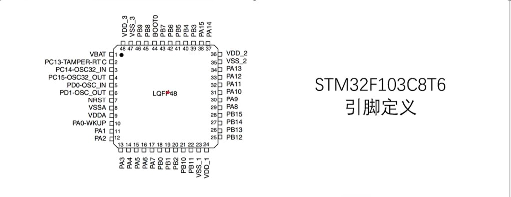

# STM32F103C8T6 引脚说明（LQFP48）

> **相关文档**  
> - [文件说明.md](./文件说明.md) — Embedded 目录索引  
> - [STM32最小系统板与面包板器件说明.md](./STM32最小系统板与面包板器件说明.md) — 蓝 pill 开发板与套件接线  
> - [STM32外设说明.md](./STM32外设说明.md) — GPIO、UART、I2C 等外设用法  
> - [STM32系统结构说明.md](./STM32系统结构说明.md) — APB1/APB2 与外设挂载  
> - [STM32短期入门规划.md](./STM32短期入门规划.md) — 入门实验常用引脚

更新时间：2026-07-12

---

## 一、一句话理解

**STM32F103C8T6** 采用 **LQFP48** 封装，共 **48 个引脚**：电源/地、复位、启动、晶振，以及 **PA / PB / PC / PD** 的 **GPIO**；同一引脚往往还有 **复用功能**（USART、I2C、SPI、ADC、TIM 等）。

下图是芯片 **俯视图** 引脚编号（从左上角 Pin 1 起逆时针数到 Pin 48）：



**记忆口诀**：**先看电源地，再看 NRST/BOOT0；PA9/10 串口，PB6/7 I2C；PA13/14 别占，留给 ST-Link。**

---

## 二、引脚编号规则

```text
        Pin37～48（顶边）
              ┌────┐
  Pin1～12    │芯片│    Pin25～36
  （左边）     └────┘    （右边）
        Pin13～24（底边）

编号：从 Pin 1 起，逆时针递增至 Pin 48。
```

蓝 pill 最小系统板将排针引出大部分 GPIO；**原理图以你手上板子为准**（个别板子未引出 PC14/15 等）。

板载元器件实拍见 [STM32最小系统板与面包板器件说明.md](./STM32最小系统板与面包板器件说明.md) §3.1（`stm32-blue-pill-board.png`）。

### 2.1 蓝 pill 排针丝印（板子俯视图）

丝印为 **端口简写**（`A9` = **PA9**，`B6` = **PB6**）；`G` = GND，`3.3` = 3.3 V，`5V` = 5 V（来自 USB，不经 LDO）。**从左到右**为面向板子、USB 口朝左时的读法：

| 排 | 丝印顺序（左 → 右） |
|----|---------------------|
| **上排** | G, G, 3.3, R, B11, B10, B1, B0, A7, A6, A5, A4, A3, A2, A1, A0, C15, C14, C13, VB |
| **下排** | B12, B13, B14, B15, A8, A9, A10, A11, A12, A15, B3, B4, B5, B6, B7, B8, B9, 5V, G, 3.3 |

| 丝印 | 常见含义 |
|------|----------|
| **R** | 接 **NRST**（复位）；部分板子标为 `NRST` |
| **VB** / **VBAT** | RTC 备份域 **VBAT**（无电池时常接 3.3 V） |
| **A9 / A10** | ★ **USART1** TX/RX，接 USB-TTL 调试 |
| **B6 / B7** | ★ **I2C1** SCL/SDA，接 OLED |
| **A13 / A14** | 未在排针丝印标出；经板载 **SWD 口** 引出（SWDIO/SWCLK） |

板右侧 **4 针 SWD 排针**（上 → 下）：`GND`、`SWCLK`、`SWDIO`、`3.3V` — 接 ST-Link 时优先用此口，比从双排针飞线更稳。

---

## 三、电源、复位与启动（必知）

| Pin | 名称 | 类型 | 说明 |
|-----|------|------|------|
| **1** | **VBAT** | 电源 | RTC、备份域供电；可接 3 V 电池保持走时；无电池时 often 接 3.3 V |
| **7** | **NRST** | 复位 | 低电平复位；板载复位键到此脚 |
| **8** | **VSSA** | 地 | **模拟地**，ADC/DAC 参考；布局时与数字地单点相连 |
| **9** | **VDDA** | 电源 | **模拟电源** 3.3 V，给 ADC 等模拟电路 |
| **23** | **VSS_1** | 地 | 数字地 |
| **24** | **VDD_1** | 电源 | 数字电源 3.3 V |
| **35** | **VSS_2** | 地 | 数字地 |
| **36** | **VDD_2** | 电源 | 数字电源 3.3 V |
| **44** | **BOOT0** | 启动 | **启动模式**：接 GND（0）从 Flash 运行；接 3.3 V（1）进系统存储器/串口下载 |
| **47** | **VSS_3** | 地 | 数字地 |
| **48** | **VDD_3** | 电源 | 数字电源 3.3 V |

**BOOT0 与蓝 pill 黄色跳线帽**：正常运行插在 **0/GND**；下载固件时改 **1** 再复位（以板子丝印为准）。

---

## 四、晶振与 32.768 kHz（时钟引脚）

| Pin | 名称 | 说明 |
|-----|------|------|
| **3** | **PC14-OSC32_IN** | **32.768 kHz** 低速晶振输入（RTC） |
| **4** | **PC15-OSC32_OUT** | 32.768 kHz 晶振输出 |
| **5** | **PD0-OSC_IN** | **8 MHz** 高速主晶振输入（HSE） |
| **6** | **PD1-OSC_OUT** | 8 MHz 主晶振输出 |

蓝 pill 板载 **8 MHz 晶振** 接 HSE；32 kHz 晶振部分板子未贴装，PC14/15 可作普通 GPIO（需配置）。

---

## 五、全部 48 引脚一览表

下表列出 **默认主功能** 与 **常用复用功能**（完整列表见 ST Datasheet / RM0008 **Alternate function mapping**）。

**图例**：★ = 入门套件/本项目常见用法

| Pin | 引脚名 | 默认/GPIO | 常用复用功能 | 备注 |
|-----|--------|-----------|--------------|------|
| 1 | VBAT | 电源 | RTC 备份域 | 见 §三 |
| 2 | PC13 | PC13 | TAMPER-RTC | ★ 蓝 pill **板载 LED** 常接此脚 |
| 3 | PC14 | PC14 | OSC32_IN | 32k 晶振 |
| 4 | PC15 | PC15 | OSC32_OUT | 32k 晶振 |
| 5 | PD0 | PD0 | OSC_IN | 8 MHz HSE |
| 6 | PD1 | PD1 | OSC_OUT | 8 MHz HSE |
| 7 | NRST | 复位 | — | 复位键 |
| 8 | VSSA | 模拟地 | — | |
| 9 | VDDA | 模拟 3.3 V | — | ADC 参考 |
| 10 | PA0 | PA0 | ADC1_IN0, TIM2_CH1, TIM5_CH1, WKUP | ★ ADC / 唤醒 |
| 11 | PA1 | PA1 | ADC1_IN1, TIM2_CH2, TIM5_CH2 | ★ ADC |
| 12 | PA2 | PA2 | ADC1_IN2, **USART2_TX**, TIM2_CH3 | ★ 串口2 发 ★ 模组 TX 常用 |
| 13 | PA3 | PA3 | ADC1_IN3, **USART2_RX**, TIM2_CH4 | ★ 串口2 收 |
| 14 | PA4 | PA4 | ADC1_IN4, **SPI1_NSS**, USART2_CK | SPI1 片选 |
| 15 | PA5 | PA5 | ADC1_IN5, **SPI1_SCK** | SPI1 时钟 |
| 16 | PA6 | PA6 | ADC1_IN6, **SPI1_MISO**, TIM3_CH1 | ★ TIM3 PWM（舵机常试） |
| 17 | PA7 | PA7 | ADC1_IN7, **SPI1_MOSI**, TIM3_CH2 | SPI1 数据出 |
| 18 | PB0 | PB0 | ADC1_IN8, TIM3_CH3 | ★ ADC / GPIO |
| 19 | PB1 | PB1 | ADC1_IN9, TIM3_CH4 | ★ ADC / GPIO |
| 20 | PB2 | PB2 | GPIO / BOOT1 | 一般作 GPIO；BOOT1 配合启动 |
| 21 | PB10 | PB10 | **I2C2_SCL**, USART3_TX, TIM2_CH3 | I2C2 / 串口3 |
| 22 | PB11 | PB11 | **I2C2_SDA**, USART3_RX, TIM2_CH4 | I2C2 / 串口3 |
| 23 | VSS_1 | 地 | — | |
| 24 | VDD_1 | 3.3 V | — | |
| 25 | PB12 | PB12 | **SPI2_NSS**, I2C2_SMBAL, USART3_CK, TIM1_BKIN, CAN_RX | ★ 蜂鸣器/驱动 GPIO 常用 |
| 26 | PB13 | PB13 | **SPI2_SCK**, USART3_CTS, TIM1_CH1N, CAN_TX | |
| 27 | PB14 | PB14 | **SPI2_MISO**, USART3_RTS, TIM1_CH2N | |
| 28 | PB15 | PB15 | **SPI2_MOSI**, TIM1_CH3N | |
| 29 | PA8 | PA8 | **TIM1_CH1**, USART1_CK, MCO | 时钟输出 MCO |
| 30 | PA9 | PA9 | **USART1_TX**, TIM1_CH2 | ★ **USB-TTL / 调试串口 TX** |
| 31 | PA10 | PA10 | **USART1_RX**, TIM1_CH3 | ★ **调试串口 RX** |
| 32 | PA11 | PA11 | USART1_CTS, TIM1_CH4, USBDM, CAN_RX | USB 设备 D-（C8 无 USB 固件时常作 GPIO） |
| 33 | PA12 | PA12 | USART1_RTS, TIM1_ETR, USBDP, CAN_TX | USB D+ |
| 34 | PA13 | PA13 | **SWDIO** / JTMS | ★ **ST-Link 数据** — 勿占用 |
| 35 | VSS_2 | 地 | — | |
| 36 | VDD_2 | 3.3 V | — | |
| 37 | PA14 | PA14 | **SWCLK** / JTCK | ★ **ST-Link 时钟** — 勿占用 |
| 38 | PA15 | PA15 | **SPI1_NSS**, JTDI | JTAG；释放需禁用 JTAG |
| 39 | PB3 | PB3 | **SPI1_SCK**, JTDO | JTAG；作 GPIO 需关 JTAG |
| 40 | PB4 | PB4 | **SPI1_MISO**, JTRST | 同上 |
| 41 | PB5 | PB5 | **SPI1_MOSI**, I2C1_SMBAL | |
| 42 | PB6 | PB6 | **I2C1_SCL**, TIM4_CH1 | ★ **OLED I2C 时钟** |
| 43 | PB7 | PB7 | **I2C1_SDA**, TIM4_CH2 | ★ **OLED I2C 数据** |
| 44 | BOOT0 | 启动 | — | 见 §三 |
| 45 | PB8 | PB8 | TIM4_CH3, I2C1_SCL(重映射), CAN_RX | |
| 46 | PB9 | PB9 | TIM4_CH4, I2C1_SDA(重映射), CAN_TX | |
| 47 | VSS_3 | 地 | — | |
| 48 | VDD_3 | 3.3 V | — | |

---

## 六、按端口分组（GPIO 视角）

### 6.1 PA 口（Pin 10～17, 29～34, 37～38）

| GPIO | ADC | 串口 | SPI | I2C | 定时器 | 其他 |
|------|-----|------|-----|-----|--------|------|
| PA0 | IN0 | — | — | — | TIM2/5 | WKUP 唤醒 |
| PA1 | IN1 | — | — | — | TIM2/5 | |
| PA2 | IN2 | **USART2_TX** | — | — | TIM2 | ★ 接模组 TX |
| PA3 | IN3 | **USART2_RX** | — | — | TIM2 | ★ 接模组 RX |
| PA4 | IN4 | USART2_CK | NSS | — | — | |
| PA5 | IN5 | — | SCK | — | — | |
| PA6 | IN6 | — | MISO | — | TIM3_CH1 | PWM |
| PA7 | IN7 | — | MOSI | — | TIM3_CH2 | |
| PA8 | — | USART1_CK | — | — | TIM1_CH1 | MCO |
| PA9 | — | **USART1_TX** | — | — | TIM1_CH2 | ★ printf 调试 |
| PA10 | — | **USART1_RX** | — | — | TIM1_CH3 | ★ |
| PA11 | — | USART1_CTS | — | — | TIM1_CH4 | USB/CAN |
| PA12 | — | USART1_RTS | — | — | TIM1_ETR | USB/CAN |
| PA13 | — | — | — | — | — | **SWDIO** |
| PA14 | — | — | — | — | — | **SWCLK** |
| PA15 | — | — | NSS | — | — | JTAG DI |

### 6.2 PB 口（Pin 18～22, 25～28, 39～46）

| GPIO | ADC | 串口 | SPI | I2C | 定时器 | 其他 |
|------|-----|------|-----|-----|--------|------|
| PB0 | IN8 | — | — | — | TIM3_CH3 | |
| PB1 | IN9 | — | — | — | TIM3_CH4 | |
| PB2 | — | — | — | — | — | BOOT1 |
| PB10 | — | USART3_TX | — | **I2C2_SCL** | TIM2_CH3 | |
| PB11 | — | USART3_RX | — | **I2C2_SDA** | TIM2_CH4 | |
| PB12 | — | USART3_CK | NSS | SMBAL | TIM1_BKIN | CAN_RX |
| PB13 | — | CTS | SCK | — | TIM1_CH1N | CAN_TX |
| PB14 | — | RTS | MISO | — | TIM1_CH2N | |
| PB15 | — | — | MOSI | — | TIM1_CH3N | |
| PB3 | — | — | SCK | — | — | JTAG |
| PB4 | — | — | MISO | — | — | JTAG |
| PB5 | — | — | MOSI | SMBAL | — | |
| PB6 | — | — | — | **I2C1_SCL** | TIM4_CH1 | ★ OLED |
| PB7 | — | — | — | **I2C1_SDA** | TIM4_CH2 | ★ OLED |
| PB8 | — | — | — | SCL(重映射) | TIM4_CH3 | CAN_RX |
| PB9 | — | — | — | SDA(重映射) | TIM4_CH4 | CAN_TX |

### 6.3 PC / PD 口

| GPIO | 主要用途 |
|------|----------|
| **PC13** | ★ 板载 LED；RTC TAMPER |
| **PC14** | 32.768 kHz 晶振 IN |
| **PC15** | 32.768 kHz 晶振 OUT |
| **PD0** | 8 MHz HSE IN |
| **PD1** | 8 MHz HSE OUT |

> **F103C8** 无 **PC0～PC12**、**PD2～PD15** 等引脚（封装未引出）。

---

## 七、入门套件推荐接线（蓝 pill）

与 [STM32最小系统板与面包板器件说明.md](./STM32最小系统板与面包板器件说明.md) 一致：

| 功能 | 引脚 | 外设模式 |
|------|------|----------|
| ST-Link SWD | PA13、PA14、GND、3.3V | 保持默认 SWD |
| USB-TTL 调试 | PA9 TX → TTL RX；PA10 RX → TTL TX | **USART1** |
| OLED I2C | PB6 SCL、PB7 SDA | **I2C1** |
| 板载 LED | PC13 | **GPIO 输出** |
| 蜂鸣器模块 IN | PB12 或 PA0 等 | **GPIO 输出** |
| 传感器 DO | 任意 PA/PB | **GPIO 输入** |
| 传感器 AO | PA0～PA7、PB0～PB1 | **ADC1** |
| 舵机 PWM | PA6 TIM3_CH1 等 | **TIM PWM** |
| Wi-Fi/4G/BLE 模组 | PA2/PA3 **USART2** 或 PA9/10 之一 | **USART** |
| 按键 | PB0、PA0 等 | GPIO + 上拉 / EXTI |

**UART 交叉**：MCU **TX** 接模组 **RX**，MCU **RX** 接模组 **TX**。

---

## 八、复用功能与 CubeMX

同一引脚 **同一时间只能一种主功能**：

1. 在 **Pinout** 点击引脚 → 选 `USART1_TX` / `I2C1_SCL` 等。  
2. Cube 自动设 **复用推挽** 模式。  
3. **F1** 部分引脚需 **AFIO 重映射**（Remap）；Cube 勾选 *Configuration → SYS → JTAG* 可释放 PA15/PB3/PB4。  

| 冲突示例 | 处理 |
|----------|------|
| PA13/14 想当 GPIO | 会失去 SWD，无法再 ST-Link 下载 |
| PB6/7 作 I2C 又作 GPIO | 同时只能一种；OLED 占用时勿改 |
| USART1 与 TIM1 同脚 | 二选一，由 Cube 配置决定 |

---

## 九、电流与保护（接线禁忌）

| 规则 | 说明 |
|------|------|
| 单 GPIO 电流 | 建议 **≤ 20 mA**，勿直接驱动电机/大蜂鸣器电流 |
| 5 V 容忍 | F103 多数脚 **不 5V 容忍**（除个别标注 FT）；模块输出 5 V 需电平转换 |
| 模拟脚 | ADC 用 PA0～PA7 等时，配置 **模拟输入**，远离数字噪声 |
| 未用脚 | 可设为上拉输入，避免浮空干扰 |

---

## 十、与本项目设备引脚规划（参考）

量产板原理图会与学习板不同，逻辑分层一致：

```text
USARTx  ──► Wi-Fi / 4G / BLE 模组（MQTT / 透传）
I2C     ──► 机身 OLED
ADC     ──► 水位 / 压力 / 4～20 mA 后级
GPIO    ──► 继电器、声光告警、数字量
TIM PWM ──► 闸门开度 / 风机
SWD     ──► 生产烧录与维护口（预留测试点）
```

具体引脚以 **项目原理图 BOM** 为准；学习阶段用 §七 默认脚位即可。

---

## 十一、常见问题

| 问题 | 原因 | 处理 |
|------|------|------|
| 烧录失败 | PA13/14 被占用 | 恢复 SWD 或串口 BOOT0 下载 |
| 串口无字 | 不是 PA9/10 或没开 USART1 | 查 Cube 引脚与线是否交叉 |
| OLED 不亮 | PB6/7 接错 | SCL/SDA 对调检查 |
| PC13 LED 不亮 | 低电平点亮 vs 高电平点亮 | 看板子电路是灌电流还是拉电流 |
| ADC 乱跳 | 数字脚与模拟脚混在一起 | 模拟脚远离开关噪声 |

---

## 十二、自检问答

1. Pin 30、31 默认适合做什么？  
   → **USART1 TX/RX**（调试串口）。  

2. OLED I2C 常用哪两脚？  
   → **PB6（SCL）、PB7（SDA）**。  

3. ST-Link 必须接哪几个脚？  
   → **PA13 SWDIO、PA14 SWCLK、GND**（3.3V 可选）。  

4. BOOT0 在 Pin 几？正常运行接哪里？  
   → **Pin 44**；接 **GND（0）** 从 Flash 启动。  

5. F103C8 有几个 ADC 通道在 PA 口？  
   → **PA0～PA7** 对应 **ADC1_IN0～IN7**。  

---

## 十三、延伸阅读

| 资料 | 内容 |
|------|------|
| [STM32F103x8 Datasheet](https://www.st.com/resource/en/datasheet/stm32f103c8.pdf) | Pinout、电气特性 |
| RM0008 Reference Manual | Table 5 **Alternate functions** 完整映射 |
| [STM32外设说明.md](./STM32外设说明.md) | 外设功能说明 |
| [STM32系统结构说明.md](./STM32系统结构说明.md) | USART1 在 APB2、I2C1 在 APB1 |
