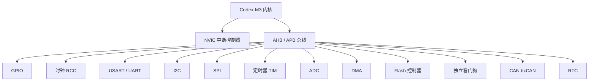

# STM32 外设说明

> **相关文档**  
> - [文件说明.md](./文件说明.md) — Embedded 目录索引  
> - [STM32系统结构说明.md](./STM32系统结构说明.md) — 芯片系统框图、总线与 APB 外设分布  
> - [ARM处理器系列说明.md](./ARM处理器系列说明.md) — Cortex-M3 内核与芯片厂分工  
> - [STM32最小系统板与面包板器件说明.md](./STM32最小系统板与面包板器件说明.md) — 外设与套件器件对照（§四）  
> - [STM32短期入门规划.md](./STM32短期入门规划.md) — 2 周先学 GPIO / UART / I2C  
> - [STM32嵌入式学习路线与能力规划.md](./STM32嵌入式学习路线与能力规划.md) — 外设学习阶段排期  
> - [../DeviceAccess/Modbus/MCU与UART说明.md](../DeviceAccess/Modbus/MCU与UART说明.md) — UART 在本项目硬件链中的角色  
> - [../DeviceAccess/Network/无线通信方式说明.md](../DeviceAccess/Network/无线通信方式说明.md) — Wi-Fi/4G/BLE 模组经 UART 接 MCU

更新时间：2026-07-12

---

## 一、一句话理解

**外设**（Peripheral）是 STM32 芯片内除 **CPU 内核** 以外的硬件功能模块：GPIO、串口、定时器、ADC 等。  
固件通过 **寄存器** 配置外设；入门阶段用 **STM32CubeMX + HAL 库** 生成初始化代码。

本文以学习板 **STM32F103C8T6（Cortex-M3）** 为主，说明各外设 **是什么、驱动什么硬件、在本项目里干什么**。

```text
CPU 执行 C 代码
    │ 读写寄存器
    ▼
外设（GPIO / UART / TIM / ADC …）
    │ 引脚
    ▼
板子上的 LED、OLED、模组、传感器
```

**记忆口诀**：**外设是单片机的手脚和嘴巴；引脚是接线端子；HAL 是 ST 写的驱动说明书。**

---

## 二、外设体系总览

### 2.1 芯片里有什么（F103 视角）



### 2.2 外设分类速查

| 类别 | 外设 | 主要作用 | 入门套件常用 |
|------|------|----------|:------------:|
| **基础** | RCC、GPIO、EXTI、NVIC、SysTick | 时钟、引脚、中断、节拍 | ✅ |
| **通信** | USART/UART、I2C、SPI、CAN、USB | 连模组、传感器、总线 | ✅ UART/I2C |
| **采集/控制** | ADC、TIM（PWM/捕获） | 模拟量、电机、舵机 | ✅ TIM |
| **系统** | DMA、Flash、IWDG、RTC、CRC | 减负、存参、看门狗、时钟 | 后期 |
| **调试** | SWD（PA13/PA14） | ST-Link 烧录 | ✅ |

> 不同 STM32 系列外设数量不同（F4 有 DAC、F7 有以太网等）。**概念相通**，换芯片时查 **Reference Manual** 与 CubeMX 勾选即可。

---

## 三、学习顺序与文档对照

| 顺序 | 外设 | 短期 2 周 | 长期 16 周 | 套件实验 |
|------|------|:---------:|:----------:|----------|
| 1 | GPIO | ✅ | ✅ | LED、蜂鸣器、按键 |
| 2 | RCC / SysTick | ✅ | ✅ | 闪烁延时、1 s 节拍 |
| 3 | USART | ✅ | ✅ | USB-TTL `printf` |
| 4 | I2C | ✅ | ✅ | OLED |
| 5 | TIM | ✅ | ✅ | 非阻塞调度、PWM 舵机 |
| 6 | EXTI | — | ✅ | 按键/编码器边沿 |
| 7 | ADC | — | ✅ | 光敏/声音 AO |
| 8 | SPI | — | ✅ | 部分屏/Flash |
| 9 | DMA | — | ✅ | ADC+UART 减负 |
| 10 | Flash | — | ✅ | 参数掉电保存 |
| 11 | IWDG | — | ✅ | 死机复位 |
| 12 | CAN | — | 可选 | 车载/工业总线 |

---

## 四、基础外设

### 4.1 RCC（时钟控制）

| 项 | 说明 |
|----|------|
| **是什么** | **Reset and Clock Control**：为 CPU 和各外设提供时钟源与分频 |
| **F103 常见配置** | 外部 8 MHz 晶振（HSE）→ PLL 倍频 → **72 MHz** 系统时钟 |
| **为何要配** | 外设必须先 **使能时钟**（`__HAL_RCC_*_CLK_ENABLE()`）才能工作 |
| **CubeMX** | Clock Configuration 页图形化配置 |

**记忆**：外设不亮/不工作，先查 **时钟是否打开**、引脚是否复用对。

---

### 4.2 GPIO（通用输入输出）

| 项 | 说明 |
|----|------|
| **是什么** | 每个 **PAx / PBx / PCx …** 引脚可设为输入或输出，读写 **高/低电平** |
| **模式** | 推挽输出、开漏输出、上拉/下拉输入、模拟输入（给 ADC） |
| **详解** | 八种模式与位结构见 [STM32-GPIO说明.md](./STM32-GPIO说明.md) |
| **驱动对象** | LED、蜂鸣器 IN、继电器、传感器 **DO**、L293D 逻辑脚 |
| **HAL 示例** | `HAL_GPIO_WritePin()`、`HAL_GPIO_ReadPin()` |
| **板载** | **PC13** 接用户 LED（低电平点亮，视板子电路而定） |

**本项目**：数字量采集、告警输出、驱动有源蜂鸣器模块。

---

### 4.3 AFIO / 引脚复用（F103）

| 项 | 说明 |
|----|------|
| **是什么** | 同一引脚可 **复用** 为 GPIO 或 USART/I2C/TIM 等外设功能 |
| **F103 特点** | 有 **AFIO** 模块，部分引脚可 **重映射**（Remap） |
| **CubeMX** | Pinout 里选 `USART1_TX` 后，该脚自动变为复用推挽，无需手写 AF 寄存器 |

**常用引脚（蓝 pill 习惯用法）**：

| 引脚 | 常见功能 |
|------|----------|
| PA9 / PA10 | USART1 TX / RX（串口 1） |
| PB6 / PB7 | I2C1 SCL / SDA（OLED） |
| PA13 / PA14 | SWDIO / SWCLK（ST-Link，勿占用） |
| PA0～PA7 等 | ADC1_INx、TIM2_CHx |

---

### 4.4 EXTI（外部中断）

| 项 | 说明 |
|----|------|
| **是什么** | 引脚 **边沿**（上升/下降）触发中断，不必轮询 |
| **用途** | 按键按下、编码器 A 相、倾斜传感器脉冲 |
| **与 NVIC** | EXTI 产生中断请求 → **NVIC** 仲裁 → 进 `HAL_GPIO_EXTI_Callback` |
| **注意** | F103 一条 EXTI 线同一时刻对应多个 Port 同源编号（如 PA0 与 PB0 不能同时做 EXTI0） |

---

### 4.5 NVIC（嵌套向量中断控制器）

| 项 | 说明 |
|----|------|
| **是什么** | Cortex-M 内核的中断调度：优先级、嵌套、使能/屏蔽 |
| **用途** | UART 收字节、定时器到点、按键 EXTI 均通过 NVIC 进中断服务函数 |
| **学习要点** | 优先级数值 **越小越优先**（HAL 里常写 0～15）；中断里少做耗时操作 |

---

### 4.6 SysTick

| 项 | 说明 |
|----|------|
| **是什么** | 内核自带的 **1 ms 系统节拍** 定时器 |
| **用途** | `HAL_Delay()`、`HAL_GetTick()` 时间戳 |
| **局限** | 阻塞延时占 CPU；后期用 **TIM** 或 RTOS 替代忙等 |

---

## 五、通信外设

### 5.1 USART / UART

| 项 | 说明 |
|----|------|
| **是什么** | **异步串口**：TX 发、RX 收，按波特率逐字节传输 |
| **F103 资源** | USART1/2/3、UART4/5（以具体型号为准） |
| **参数** | 常见 **115200 8N1**（8 数据位、无校验、1 停止位） |
| **HAL** | `HAL_UART_Transmit()`、`HAL_UART_Receive_IT()`、`printf` 重定向 |
| **连接** | **USB-TTL**、**ESP8266/4G AT 模组**、**BLE 透传模组**（DX-BT24） |

```text
STM32 USART TX ──► 模组 RX
STM32 USART RX ◄── 模组 TX
GND 共地
```

**本项目角色**：`printf` 调试；Wi-Fi/4G **MQTT 上云** 的 AT 或透传通道；**BLE 模组 UART** 近场配置。详见 [MCU与UART说明.md](../DeviceAccess/Modbus/MCU与UART说明.md)。

---

### 5.2 I2C

| 项 | 说明 |
|----|------|
| **是什么** | **两线总线**：**SCL** 时钟 + **SDA** 数据；多从机、地址寻址 |
| **F103** | I2C1、I2C2；需 **上拉电阻**（板载或外部 4.7 kΩ） |
| **速率** | 标准 100 kHz；快速 400 kHz |
| **HAL** | `HAL_I2C_Mem_Write()` / `Mem_Read()` 操作从机寄存器 |
| **套件** | **OLED SSD1306**（地址常 **0x3C** 或 0x3D） |

**记忆**：I2C 适合 **短距、少线、多芯片**（屏、温湿度、RTC）；速度低于 SPI。

---

### 5.3 SPI

| 项 | 说明 |
|----|------|
| **是什么** | **四线**：SCK、MISO、MOSI、CS；全双工、速度快 |
| **F103** | SPI1、SPI2 |
| **用途** | NOR Flash、部分 TFT 屏、高速 ADC、SD 卡（高级型号） |
| **与 I2C** | 引脚多、速度快；OLED 常见 I2C 版，SPI 版刷新更快 |

---

### 5.4 CAN（bxCAN）

| 项 | 说明 |
|----|------|
| **是什么** | **控制器局域网**：差分总线，抗干扰，车载与工业常见 |
| **F103** | 部分型号 1 路 CAN；需 **CAN 收发器** 芯片接物理总线 |
| **本项目** | 水务现场更常见 **RS485 Modbus**；CAN 作扩展知识 |

---

### 5.5 USB

| 项 | 说明 |
|----|------|
| **是什么** | F103 部分型号带 **USB Device**（全速 12 Mbps） |
| **蓝 pill** | Micro USB 口多数 **只供电**；USB 设备功能需硬件与固件同时支持 |
| **对比** | 日常调试多用 **ST-Link SWD** + **USB-TTL 串口**，而非 USB 虚拟串口设备模式 |

---

## 六、采集与控制外设

### 6.1 ADC（模数转换器）

| 项 | 说明 |
|----|------|
| **是什么** | 把引脚 **模拟电压** 转成数字量（F103 多为 **12 位**，0～4095） |
| **参考电压** | 通常 **VDDA = 3.3 V**；换算：电压 = 采样值 / 4095 × 3.3 |
| **模式** | 单次、连续、扫描多通道；配合 **DMA** 自动搬运 |
| **引脚** | 配置为 **模拟输入**（GPIO_MODE_ANALOG） |
| **套件** | 光敏/声音模块 **AO** 脚；电位器分压 |

**注意**：模拟脚附近避免数字信号干扰；采样前可加 **软件滤波**（平均/中值）。

---

### 6.2 TIM（定时器）

| 项 | 说明 |
|----|------|
| **是什么** | 硬件计数器：定时、输出 **PWM**、测量脉冲宽度/频率 |
| **F103 分类** | 高级定时器 TIM1/TIM8；通用 TIM2～5 等 |
| **用途** | |
| → **时基** | 每 1 ms/1 s 置标志，主循环非阻塞 |
| → **PWM** | **9g 舵机**（50 Hz，1～2 ms 脉宽）、电机调速、无源蜂鸣器变频 |
| → **输入捕获** | 测转速、红外遥控脉宽 |
| **HAL** | `HAL_TIM_PWM_Start()`、`HAL_TIM_Base_Start_IT()` |

**记忆**：**不要用空循环延时霸占 CPU**；周期任务交给 TIM 或 SysTick。

详见专文：[STM32-定时器Timer说明.md](./STM32-定时器Timer说明.md)（定时中断、时钟源、OC、IC）。

---

### 6.3 DMA（直接存储器访问）

| 项 | 说明 |
|----|------|
| **是什么** | 硬件在 **内存 ↔ 外设** 间搬数据，CPU 可做别的事 |
| **常见组合** | ADC 连续采样 → DMA → 缓冲区；UART RX → DMA 环形缓冲 |
| **模式** | Normal（一次）、Circular（循环，适合连续采集） |
| **学习阶段** | 长期规划阶段 2～3；短期班可不写 DMA |

---

## 七、系统与可靠性外设

### 7.1 Flash 控制器

| 项 | 说明 |
|----|------|
| **是什么** | 管理片内 **Flash** 读写的硬件；程序本身也存于 Flash |
| **应用** | **模拟 EEPROM**：在 Flash 末尾划一页存阈值、设备编号、校准系数 |
| **注意** | 擦写次数有限（约 1 万次量级）；擦除粒度为 **页**，写入前须擦除 |

---

### 7.2 IWDG / WWDG（看门狗）

| 项 | 说明 |
|----|------|
| **IWDG** | **独立看门狗**，单独 RC 振荡，死机后复位 MCU |
| **WWDG** | 窗口看门狗，须在特定时间窗内喂狗 |
| **用途** | 野外设备防程序跑飞；主循环或定时器里 `HAL_IWDG_Refresh()` |
| **本项目** | 7×24 采集节点建议启用 IWDG |

---

### 7.3 RTC（实时时钟）

| 项 | 说明 |
|----|------|
| **是什么** | 低功耗域 **年月日时分秒** 计时；F103 需 **VBAT** 电池保持掉电走时 |
| **用途** | 报文时间戳、定时唤醒、日志记录 |
| **与平台** | 上报 JSON 的 `timestamp` 可来自 RTC 或模组网络时间 |

---

### 7.4 CRC

| 项 | 说明 |
|----|------|
| **是什么** | 硬件计算 CRC 校验值 |
| **用途** | 自定义串口帧、Modbus 以外的协议校验加速 |

---

## 八、调试接口（非业务外设）

| 接口 | 引脚 | 作用 |
|------|------|------|
| **SWD** | PA13 SWDIO、PA14 SWCLK | ST-Link 烧录、单步调试 |
| **NRST** | 复位脚 | 硬件复位 |
| **BOOT0** | 启动模式 | 运行 Flash / 串口下载 |

**勿把 SWD 脚当普通 GPIO 占用**，否则无法下载。

---

## 九、外设 ↔ 入门套件 ↔ 本项目

| 外设 | 套件硬件 | 本项目设备中的角色 |
|------|----------|-------------------|
| GPIO | LED、蜂鸣器、传感器 DO | 数字量、告警、继电器 |
| USART | USB-TTL、Wi-Fi/4G/BLE 模组 | 调试、**MQTT 上云**、近场透传 |
| I2C | OLED | 机身小屏、本地显示 |
| ADC | 光敏/声音 AO | 模拟量采集（水位/压力等经变送器） |
| TIM | 舵机、电机 PWM | 闸门开度、风机调速 |
| SPI | （可选屏/Flash） | 扩展存储或高速屏 |
| Flash | — | 参数、配置掉电保存 |
| IWDG | — | 野外长期可靠运行 |
| CAN | — | 可选工业总线 |

```text
┌──────────────────────────────────────────┐
│ STM32F103                                │
│  GPIO ──► LED / 蜂鸣器 / DO 传感器        │
│  ADC  ──► 模拟传感器 AO                   │
│  TIM  ──► 舵机 / PWM                      │
│  I2C  ──► OLED                            │
│  UART1──► USB-TTL 调试                     │
│  UART2──► Wi-Fi/4G 模组 ──MQTT──► 平台    │
│  UART3──► BLE 透传 ──► 手机近场配置        │
└──────────────────────────────────────────┘
```

---

## 十、CubeMX 配置习惯

| 步骤 | 操作 |
|------|------|
| 1 | 新建工程，选 **STM32F103C8** |
| 2 | **Pinout**：点引脚选 `GPIO_Output`、`USART1_TX`、`I2C1` 等 |
| 3 | **Clock**：HSE + PLL = 72 MHz |
| 4 | **Configuration**：UART 波特率、I2C 地址模式、TIM 频率 |
| 5 | **Project → Generate Code** |
| 6 | 在 `USER CODE` 区写逻辑，避免手改会被覆盖的生成区 |

**HAL 命名规律**：`HAL_<外设>_<动作>()`，如 `HAL_UART_Transmit`、`HAL_I2C_Mem_Write`。

---

## 十一、常见问题

| 现象 | 可能原因 | 排查 |
|------|----------|------|
| 外设完全不工作 | 时钟未使能 | `__HAL_RCC_*_CLK_ENABLE` |
| 串口无输出 | TX/RX 接反、波特率错 | 交叉接线；115200 |
| I2C 无应答 | 无上拉、地址错 | 4.7 kΩ；扫 0x3C/0x3D |
| ADC 读数乱跳 | 引脚仍为数字模式 | 设为 Analog；加滤波 |
| PWM 舵机不动 | 频率不是 50 Hz | TIM 周期 20 ms |
| 烧录后 SWD 失效 | PA13/14 被改作 GPIO | 串口下载或复位进 SWD |

---

## 十二、自检问答

1. GPIO 与 UART 分别解决什么问题？  
   → GPIO 管 **高低电平**；UART 管 **字节流通信**（模组、调试）。  

2. OLED 为什么用 I2C 而不是 UART？  
   → I2C **线少**、屏芯片原生支持；很多模块出厂即 I2C 四线。  

3. `HAL_Delay` 和 TIM 中断有何区别？  
   → `HAL_Delay` **阻塞 CPU**；TIM 中断 **到点置标志**，主循环可干别的。  

4. 本项目 MQTT 走哪个外设？  
   → **UART** 连 Wi-Fi/4G 模组，模组内部 TCP/MQTT；MCU 侧常见 AT 或模组 SDK。  

5. 下一步该学哪个外设？  
   → 完成短期班后学 **ADC + DMA + Flash**，见 [STM32嵌入式学习路线与能力规划.md](./STM32嵌入式学习路线与能力规划.md)。  

---

## 十三、延伸阅读

| 资料 | 说明 |
|------|------|
| STM32F103xx Reference Manual（RM0008） | 外设寄存器权威说明 |
| STM32F103x8 Datasheet | 引脚定义、电气极限 |
| STM32CubeF1 HAL 用户手册 | `HAL_GPIO` 等 API |
| 本项目器件引脚 | [STM32最小系统板与面包板器件说明.md](./STM32最小系统板与面包板器件说明.md) §四 |
| ST 官方 | https://www.st.com/en/microcontrollers-microprocessors/stm32-32-bit-arm-cortex-mcus.html |
