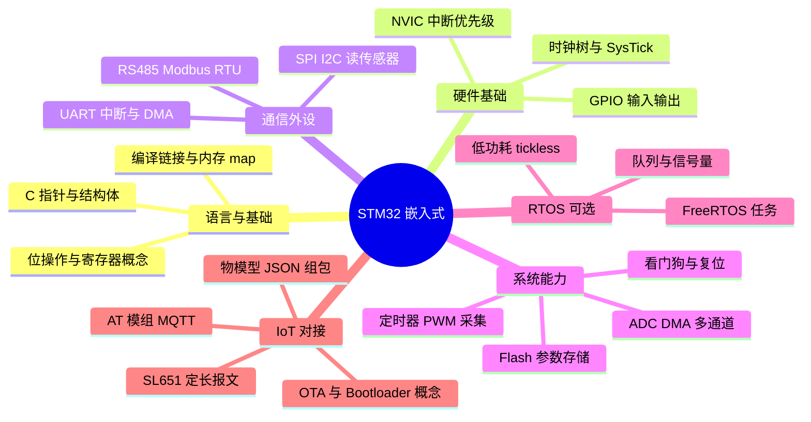

# STM32 嵌入式学习路线与能力规划

> **相关文档**  
> - [文件说明.md](./文件说明.md) — Embedded 目录索引  
> - [STM32短期入门规划.md](./STM32短期入门规划.md) — 2 周速成；建议先完成  
> - [STM32系统结构说明.md](./STM32系统结构说明.md) — 总线矩阵、AHB/APB 系统框图  
> - [STM32外设说明.md](./STM32外设说明.md) — 外设功能与学习顺序（对照阶段 1～3）  
> - [ARM处理器系列说明.md](./ARM处理器系列说明.md) — Arm 公司与 Cortex-M/A/R 系列；STM32 在内核体系中的位置  
> - [STM32最小系统板与面包板器件说明.md](./STM32最小系统板与面包板器件说明.md) — 入门硬件各器件说明（含实拍图）  
> - [../DeviceAccess/Modbus/MCU与UART说明.md](../DeviceAccess/Modbus/MCU与UART说明.md) — 本项目 MCU / UART / BLE / MQTT 硬件链  
> - [../DeviceAccess/Messaging/MQTT/MQTT说明.md](../DeviceAccess/Messaging/MQTT/MQTT说明.md) — 设备 MQTT 上云  
> - [../TSL/嵌入式节点通讯协议应用规范(基于SL651 ASCII模式).md](../TSL/嵌入式节点通讯协议应用规范(基于SL651%20ASCII模式).md) — 水利采集节点上报规范  
> - [../TSL/软件开发工作说明.md](../TSL/软件开发工作说明.md) — 嵌入式研发交付物与 L1～L4 能力分级  
> - [../Reference/工业物联网平台技术演进分析.md](../Reference/工业物联网平台技术演进分析.md) — 平台侧技术背景

更新时间：2026-07-12

---

## 一、一句话理解

**STM32** 是意法半导体（ST）的 32 位 ARM Cortex-M 微控制器系列，在工业采集、闸门控制、传感器节点中极为常见。  
**零基础建议先做** [STM32短期入门规划.md](./STM32短期入门规划.md)（**2 周**）；再按本文件 **16 周业余** 或 **8 周集中** 路线，达到可联调本平台的固件能力。

```text
学习终点（与本项目对齐）
  STM32 固件 ──UART──► BLE 透传（本地配置）
            ──Wi-Fi 模组──► MQTT 1883（遥测 / 控制）
            ──RS485──► Modbus 传感器
            ──可选──► SL651 报文上报
```

---

## 二、学习前准备

### 2.1 前置知识（建议具备）

| 领域 | 最低要求 | 推荐补齐方式 |
|------|----------|--------------|
| **C 语言** | 指针、结构体、位运算、内存布局 | 《C Primer Plus》或菜鸟教程 C 语言 §结构体/指针 |
| **数字电路** | 高/低电平、上拉下拉、串口 TX/RX | 面包板 + LED 实验 2 天 |
| **计算机基础** | 二进制/十六进制、大端小端 | 在线换算练习 |
| **Linux/命令行** | 可选 | 后期交叉编译、脚本会用到 |

若你已有 **Web / .NET 后端** 背景（如维护本平台），C 语言与硬件是主要缺口；**不必先学 RTOS**，第 9～10 周再引入 FreeRTOS 即可。

### 2.2 推荐硬件清单（入门套装）

| 物品 | 型号建议 | 用途 | 预算参考 |
|------|----------|------|----------|
| 开发板 | **STM32F103C8T6**（「蓝 pill」）或 **NUCLEO-F103RB** | GPIO、UART、定时器入门 | ¥15～80 |
| 调试器 | 板载 ST-Link（NUCLEO 自带）或 USB-TTL + 串口下载 | 烧录与单步调试 | 含在开发板 |
| USB-TTL | CH340 / CP2102 模块 | 串口打印、连 BLE/Wi-Fi 模组 | ¥8～15 |
| 基础元件 | LED、电阻、按键、杜邦线 | GPIO 实验 | ¥20 |
| 传感器 | DHT11 或 DS18B20、水位/压力模块（后期） | 采集实验 | ¥10～50 |
| 通信模组 | **ESP8266/ESP32 AT 模组** 或 **4G Cat.1 MQTT 模组** | MQTT 上云（二选一） | ¥15～80 |
| 可选 | DX-BT24 等 BLE 透传模块 | 对照本项目本地配置链路 | ¥20～40 |
| 可选 | RS485 收发器 + Modbus 传感器 | 工业现场协议 | ¥30～80 |

**路线选择**：

- **省钱路线**：F103C8T6 + USB-TTL + ESP8266，足够完成 MQTT 联调。  
- **省心路线**：NUCLEO-F103RB（自带 ST-Link + 扩展接口），调试体验更好。  
- **进阶路线**：STM32F407 / H743 开发板，留作第 13 周以后（以太网、LCD、复杂外设）。

### 2.3 软件工具

| 工具 | 用途 |
|------|------|
| **STM32CubeIDE** | ST 官方 IDE：CubeMX 图形配外设 + GCC 编译 + ST-Link 调试 |
| **STM32CubeMX** | 单独使用时可生成初始化代码（已集成在 CubeIDE 内） |
| **MQTTX** | 模拟设备 / 对照 Topic，见 [MQTTX持续在线与回执.md](../DeviceAccess/MQTTX持续在线与回执.md) |
| **SSCOM / 串口助手** | UART 抓包，见 [BLE透传模块-SSCOM与调试助手通信说明.md](../DeviceAccess/BLE/Debug/BLE透传模块-SSCOM与调试助手通信说明.md) |
| **Git** | 固件版本管理 |

**关于 HAL 与 LL**：入门阶段用 **STM32 HAL 库**（Cube 默认生成）；熟练后可读 LL 库或寄存器，理解中断与 DMA 时更高效。

---

## 三、能力目标总览

学完本路线，应达到 **L2 嵌入式开发工程师（入门）** 水平，能独立完成单产品固件并联调本平台。

### 3.1 知识能力地图



### 3.2 分级能力对照（本项目）

对照 [软件开发工作说明.md](../TSL/软件开发工作说明.md) §八：

| 级别 | 嵌入式能力概要 | 本路线结束后 |
|------|----------------|--------------|
| **L1 初级** | 在模板固件上改传感器、改上报字段 | ✅ 第 8～12 周可达 |
| **L2 开发** | 独立设计单产品采集逻辑；完成 MQTT/平台联调 | ✅ 第 12～16 周目标 |
| **L3 高级** | 多协议、低功耗、Bootloader、量产测试 | ⭕ 需额外 3～6 个月项目实践 |
| **L4 架构** | 硬件选型、RTOS 架构、协议体系 | ⭕ 长期积累 |

### 3.3 核心技能清单（可自检）

完成学习后，应能勾选以下 **20 项** 中的 **16 项以上**：

| # | 技能 | 验证方式 |
|---|------|----------|
| 1 | 用 CubeMX 新建工程、配置时钟与 SWD | 成功烧录 LED 闪烁 |
| 2 | 理解 `.ioc` 与生成代码的关系 | 改 Pin 后重新 Generate |
| 3 | GPIO 读按键、控 LED | 中断或轮询均可 |
| 4 | UART `printf` 重定向调试 | 115200 8N1 串口输出 |
| 5 | UART 中断收发定长/变长帧 | 与 SSCOM 对发协议 |
| 6 | 定时器毫秒级调度 | 非阻塞 LED 闪烁 |
| 7 | ADC 读取模拟量并滤波 | 滑动平均或中值 |
| 8 | I2C/SPI 读温湿度传感器 | 打印温湿度 |
| 9 | 内部 Flash / EEPROM 存参数 | 断电重启参数保留 |
| 10 | 独立看门狗 IWDG | 故意死循环验证复位 |
| 11 | RS485 + Modbus RTU 读寄存器 | 读仪表一个 float |
| 12 | AT 指令驱动 Wi-Fi 模组连 MQTT | 订阅下行 Topic |
| 13 | 组 JSON 上报物模型属性 | 字段与 TSL 一致 |
| 14 | 解析平台下行控制 JSON | 执行并 MQTT 回执 |
| 15 | 双通道：UART→BLE 配置 + MQTT 上云 | 对照 [MCU与UART说明.md](../DeviceAccess/Modbus/MCU与UART说明.md) |
| 16 | 用 MQTTX 与自研固件对比 Topic | Gateway 1883 联调通过 |
| 17 | 画清主循环 vs 中断 vs DMA 分工 | 能口头讲解数据流 |
| 18 | 读懂 `.map` 文件里 RAM/Flash 占用 | 知道何时会栈溢出 |
| 19 | FreeRTOS 至少 2 任务 + 队列 | 采集任务与通信任务分离 |
| 20 | 读懂 SL651 或本项目 JSON 上报规范 | 能改 `source` 字段映射 |

---

## 四、时间规划（16 周业余版）

**假设**：每周 **2 个晚上 + 1 个半天**（约 **10 小时/周**），共 **~160 小时**。

```text
阶段 0（第 0 周）     环境与 C 语言热身
阶段 1（第 1～3 周）   MCU 基础：GPIO / 时钟 / 中断 / UART
阶段 2（第 4～6 周）   采集与外设：定时器 / ADC / I2C-SPI / Flash
阶段 3（第 7～9 周）   通信与现场：RS485 Modbus / 协议帧设计
阶段 4（第 10～12 周）  IoT 上云：Wi-Fi AT / MQTT / 物模型 JSON
阶段 5（第 13～16 周）  综合项目 + RTOS + 本平台联调验收
```

### 4.1 阶段 0：环境与 C 语言热身（第 0 周，约 8 小时）

| 任务 | 产出 |
|------|------|
| 安装 STM32CubeIDE，更新 ST-Link 驱动 | 工具链可用 |
| 购买/到手开发板，点亮 LED（Blink） | 第一颗「活着的」固件 |
| 复习 C：指针、结构体、 `volatile` / `const` | 笔记 1 页 |
| 阅读 [MCU与UART说明.md](../DeviceAccess/Modbus/MCU与UART说明.md) §一～§三 | 理解本项目硬件链 |

**阶段验收**：CubeIDE Debug 单步执行，LED 以 500 ms 间隔闪烁；能说出 MCU / UART / BLE / Wi-Fi 在本项目中的分工。

---

### 4.2 阶段 1：MCU 基础（第 1～3 周，约 30 小时）

| 周 | 主题 | 学习内容 | 实践项目 |
|----|------|----------|----------|
| **1** | GPIO 与时钟 | HSE/PLL、SysTick、`HAL_GPIO_*` | 按键控 LED；外部中断 EXTI |
| **2** | UART 基础 | 115200 8N1、`HAL_UART_Transmit`、重定向 `printf` | 串口打印「Hello STM32」 |
| **3** | UART 进阶 | 中断接收、环形缓冲区、帧解析状态机 | 自定义帧：`AA 55 LEN DATA CRC` 收发 |

**知识要点**：

- STM32 **时钟树**：系统时钟从 HSE 经 PLL 到 72 MHz（F103）  
- **NVIC**：中断优先级分组、UART 中断与主循环协作  
- **不要用 `delay` 霸占 CPU**：用 SysTick 或定时器做非阻塞调度  

**阶段验收**：SSCOM 发命令帧，MCU 解析后回显；串口日志可定位解析错误。

---

### 4.3 阶段 2：采集与外设（第 4～6 周，约 30 小时）

| 周 | 主题 | 学习内容 | 实践项目 |
|----|------|----------|----------|
| **4** | 定时器 | 通用定时器、PWM（可选）、输入捕获（可选） | 1 s 周期采集任务（非阻塞） |
| **5** | ADC | 单通道/多通道、DMA 连续采样、简单滤波 | 电位器或水位模拟量 → 串口打印 |
| **6** | I2C/SPI + 存储 | 读 DHT11/DS18B20；Flash 模拟 EEPROM 存阈值 | 阈值断电保存；超阈值 LED 告警 |

**知识要点**：

- **ADC 分辨率与参考电压**：换算成物理量（如 4～20 mA、0～5 V）  
- **DMA**：减轻 CPU 负担，理解 Normal vs Circular 模式  
- **参数区**：对齐、磨损均衡（简单场景可用固定扇区）  

**阶段验收**：每 5 s 上报一次「温度 + 模拟量」到串口；改阈值命令写入 Flash 并重启仍有效。

---

### 4.4 阶段 3：通信与现场总线（第 7～9 周，约 30 小时）

| 周 | 主题 | 学习内容 | 实践项目 |
|----|------|----------|----------|
| **7** | RS485 与方向控制 | DE/RE 引脚、半双工时序 | USB-TTL 转 485 自环测试 |
| **8** | Modbus RTU | 功能码 03/04/06；CRC16；主站轮询 | 读 Modbus 温湿度或流量计 |
| **9** | 协议设计 | 采集与上报解耦；全局数据结构 | 参照 SL651 文档 §全局结构体思路 |

**知识要点**：

- Modbus **主站**角色：STM32 轮询传感器，不是被 PC 轮询  
- **采集任务**只更新内存结构体；**通信任务**负责 MQTT/串口封包  
- 阅读 [Modbus说明.md](../DeviceAccess/Modbus/Modbus说明.md)（若存在）与 SL651 规范中的「采集与封包解耦」  

**阶段验收**：RS485 挂 1 个 Modbus 从站，1 s 刷新全局寄存器镜像；串口打印与仪表读数一致。

---

### 4.5 阶段 4：IoT 上云（第 10～12 周，约 30 小时）

| 周 | 主题 | 学习内容 | 实践项目 |
|----|------|----------|----------|
| **10** | Wi-Fi 模组 AT | UART 连 ESP8266；`AT+CWJAP`、`AT+CIP*` 或模组 MQTT AT | 模组连上实验室路由 |
| **11** | MQTT 客户端 | 连接 Gateway **1883**；`deviceKey/deviceSecret`；订阅下行 | MQTTX 与板子互发消息 |
| **12** | 物模型 JSON | 对齐 TSL 属性 identifier；上行 post；下行 service 与回执 | 联调本平台一条属性 + 一条控制 |

**知识要点**（对照 [MQTT说明.md](../DeviceAccess/Messaging/MQTT/MQTT说明.md)）：

```text
username = deviceKey
password = deviceSecret
上行示例 Topic：iot/v1/{productKey}/{deviceKey}/up/property/post
下行控制：.../down/service/invoke
回执：.../up/service/reply
```

- 模组 **AT 固件 MQTT** vs **MCU 侧 MQTT 库**：入门用 AT 省 RAM；进阶用 **Paho MQTT embedded** 或模组 SDK  
- JSON 组包可用 **cJSON**（注意堆栈与 malloc）  

**阶段验收**：在本项目 Gateway 1883 上看到设备上线；平台监控中心或 InfluxDB 有遥测；下发一条控制命令，设备串口打印并 MQTT 回执。

---

### 4.6 阶段 5：综合项目与 RTOS（第 13～16 周，约 32 小时）

| 周 | 主题 | 学习内容 | 实践项目 |
|----|------|----------|----------|
| **13** | FreeRTOS 入门 | 任务、队列、互斥量；CubeMX 使能 CMSIS-RTOS v2 | 采集 / 通信 / HMI 三任务拆分 |
| **14** | BLE 配置通道 | UART 接 BT24；JSON 配置读写 | 手机 App 或 SSCOM 改参数 |
| **15** | 综合固件 v1 | 多传感器 + Modbus + MQTT + BLE 配置 | 「迷你采集仪」原型 |
| **16** | 联调与文档 | 对照 TSL 验收；写固件 README 与引脚表 | 交付联调记录 |

**综合项目建议规格**（与本项目最小对齐）：

| 模块 | 要求 |
|------|------|
| 采集 | ≥2 路模拟量或 1 路 Modbus + 1 路温度 |
| 存储 | 上报周期、阈值、设备编号存 Flash |
| 上云 | MQTT JSON 属性上报，周期可配置 |
| 控制 | 至少 1 个 service（如 `setThreshold`） |
| 本地 | UART→BLE 透传 JSON 读/写 3 个参数 |
| 可靠性 | 看门狗 + 通信失败重连（指数退避） |

**阶段验收（L2）**：完成 [软件开发工作说明.md](../TSL/软件开发工作说明.md) §9.1 中嵌入式侧第 3 步「实现上报与控制」，运维可在平台看到数据并完成一次控制闭环。

---

## 五、时间规划（8 周集中版）

若可 **全职或半全职**（每周 20～25 小时），将上表 **两周一合并为一 week**：

| 集中周 | 对应业余周 | 核心目标 |
|--------|------------|----------|
| 1 | 0～1 | 环境 + GPIO + UART |
| 2 | 2～3 | UART 协议 + 定时器 |
| 3 | 4～5 | ADC + 传感器 |
| 4 | 6 | Flash 参数 |
| 5 | 7～8 | RS485 Modbus |
| 6 | 9～10 | 协议结构 + Wi-Fi |
| 7 | 11～12 | MQTT + 平台联调 |
| 8 | 13～16 | RTOS + 综合项目 |

---

## 六、每周学习节奏模板

```text
单次学习块（建议 2～3 小时）
  ① 20 min  复习上一节笔记 / 读 ST 参考手册对应章节
  ② 60 min  跟着实验敲代码（禁止只看不练）
  ③ 30 min  改一个小需求（如改波特率、加一字段）
  ④ 20 min  写学习日志：现象 / 原因 / 踩坑
  ⑤ 10 min  git commit + 备份 .ioc 与关键代码
```

**日志建议路径**：`docs/learn/Embedded/logs/YYYY-MM-DD-主题.md`（个人笔记，可不提交仓库）。

---

## 七、推荐知识来源

| 类型 | 资源 | 说明 |
|------|------|------|
| 官方 | [STM32CubeIDE 用户手册](https://www.st.com/en/development-tools/stm32cubeide.html) | 安装与调试 |
| 官方 | STM32F1 **Reference Manual** + **Datasheet** | 外设细节以 RM 为准 |
| 课程 | 正点原子 / 野火 F103 视频（选一套跟完 GPIO～UART） | 中文硬件实操 |
| 书籍 | 《STM32 库开发实战指南》 | HAL 入门 |
| 协议 | [MQTT 3.1.1](https://docs.oasis-open.org/mqtt/mqtt/v3.1.1/mqtt-v3.1.1.html) | 设备侧必知 |
| 本项目 | [MQTTX持续在线与回执.md](../DeviceAccess/MQTTX持续在线与回执.md) | Gateway 联调 |
| 本项目 | [嵌入式节点通讯协议应用规范(基于SL651 ASCII模式).md](../TSL/嵌入式节点通讯协议应用规范(基于SL651%20ASCII模式).md) | 水利节点进阶 |

---

## 八、常见坑与原则

| 坑 | 对策 |
|----|------|
| 只调 HAL 不懂原理 | 第 6 周后选 1 个外设读 RM 寄存器章节 |
| 栈溢出 / HardFault | 增大任务栈；避免大数组放栈上；看 `.map` |
| MQTT 频繁断线 | 检查 KeepAlive、电源、天线；实现断线重连状态机 |
| JSON 解析占内存 | 固定缓冲区 + 手写轻量解析，或 cJSON 控深度 |
| 485 数据乱码 | 查波特率、终端电阻、DE 切换延时 |
| 与平台字段对不上 | **以 TSL identifier 为契约**，先写 payload 样例再写固件 |

**工程原则**（与本项目一致）：

1. **采集与通信解耦** — 传感器任务只写结构体，MQTT 任务只读结构体。  
2. **配置与遥测分通道** — BLE/UART 改参数，MQTT 只上报不承载大段配置 UI。  
3. **先 MQTTX 后固件** — Topic 与 JSON 在 PC 上跑通再移植到 C。  

---

## 九、进阶方向（16 周之后）

| 方向 | 内容 | 与本项目关系 |
|------|------|--------------|
| **Bootloader + OTA** | YMODEM / 自定义分区 | 现场远程升级 |
| **低功耗** | Stop/Standby、RTC 唤醒 | 电池供电节点 |
| **以太网** | W5500 + MQTT | 有线闸门柜 |
| **LCD / 小屏** | SPI 屏、简单 UI | 机身显示，对照 [低分辨率设备显示与图片说明.md](../DeviceAccess/Display/低分辨率设备显示与图片说明.md) |
| **SL651 完整实现** | ASCII 定长报文 | 水利验收 |
| **Rust / RT-Thread** | 现代嵌入式栈 | IoTSharp IoTEmbedded 生态参考 |
| **GD32 / CH32** | 国产替代 | 与 STM32 同路线，换库即可 |

---

## 十、学习验收自检（16 周结束时）

应能口头或书面回答：

1. STM32 上电后从 `main()` 到第一个 GPIO 输出，Cube 帮你做了哪些初始化？  
2. UART 中断接收为什么需要环形缓冲区？  
3. Modbus CRC 算错时现象是什么？如何排查？  
4. 本项目 MQTT 的 `username` / `password` 对应什么？Topic 里 `productKey` 在哪配置？  
5. 为什么 BLE 透传模块不需要理解 JSON？MCU 在链路中扮演什么角色？  
6. 采集任务与 MQTT 任务同时访问全局结构体，为什么要加锁或队列？  
7. 若平台看不到数据，你按什么顺序查（串口 → 模组 → Gateway → Worker）？  
8. 你的固件离 L2 嵌入式工程师还差哪 2～3 项？下一步 4 周计划是什么？

---

## 十一、与本项目联调的最小里程碑


| 里程碑 | 预计周次 | 成功标准 |
|--------|----------|----------|
| M1 | 第 3 周 | 串口日志稳定，帧协议可解析 |
| M2 | 第 8 周 | Modbus 数据与仪表一致 |
| M3 | 第 11 周 | Gateway 1883 显示设备在线 |
| M4 | 第 12 周 | 监控中心或 DB 有对应属性 |
| M5 | 第 12 周 | 控制闭环验收通过 |
| M6 | 第 15 周 | App/SSCOM 经 BLE 修改参数生效 |

---

## 十二、下一步行动（今天可做）

1. 下单 **NUCLEO-F103RB** 或 **F103C8T6 + ST-Link**。  
2. 安装 **STM32CubeIDE**，完成 [ST 官网](https://www.st.com/en/development-tools/stm32cubeide.html) 入门例程。  
3. 阅读 [MCU与UART说明.md](../DeviceAccess/Modbus/MCU与UART说明.md)，画出你理解的本项目设备硬件框图。  
4. 用 **MQTTX** 连本地 Gateway，先熟悉平台侧 Topic，再写第一行 MCU 代码。  
5. 创建个人学习日志目录，记录第 0 周 Blink 实验。
