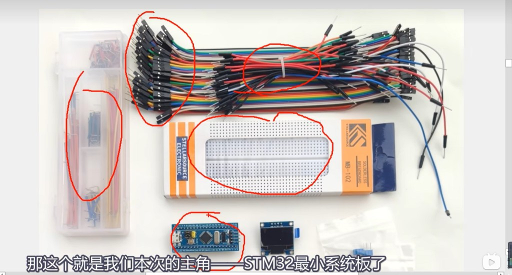
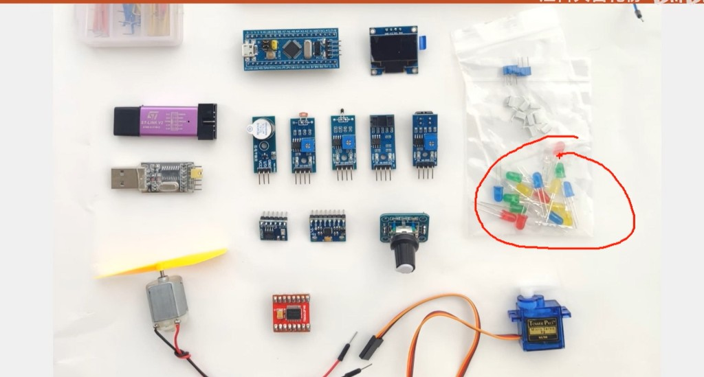
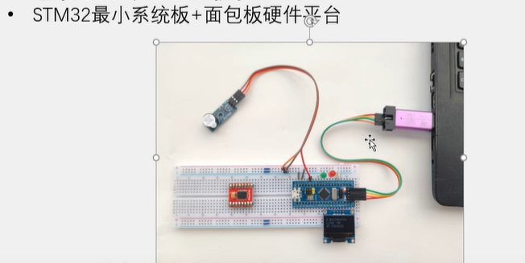
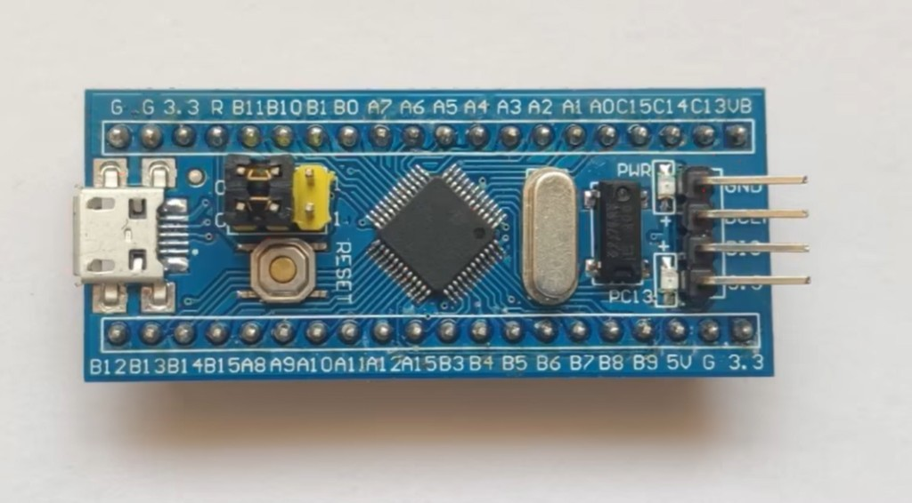

# STM32 最小系统板与面包板器件说明

> **相关文档**  
> - [文件说明.md](./文件说明.md) — Embedded 目录索引  
> - [STM32F103C8T6引脚说明.md](./STM32F103C8T6引脚说明.md) — LQFP48 全引脚与复用功能  
> - [STM32外设说明.md](./STM32外设说明.md) — GPIO / UART / I2C / ADC / TIM 等外设详解  
> - [STM32短期入门规划.md](./STM32短期入门规划.md) — **2 周短期**日程（建议先完成）  
> - [STM32嵌入式学习路线与能力规划.md](./STM32嵌入式学习路线与能力规划.md) — 长期 16 周路线  
> - [../DeviceAccess/Modbus/MCU与UART说明.md](../DeviceAccess/Modbus/MCU与UART说明.md) — MCU、UART 与本项目硬件链  
> - [../DeviceAccess/Display/低分辨率设备显示与图片说明.md](../DeviceAccess/Display/低分辨率设备显示与图片说明.md) — 机身小屏显示约束

更新时间：2026-07-12

---

## 一、一句话理解

本目录配套 **三张实拍图**，对应入门套件的不同视角：

1. **基础套件平铺图**（§1.1）：蓝 pill、MB-102 面包板、跳线、OLED、元件小包。  
2. **传感器与执行器套件图**（§1.2）：ST-Link、USB-TTL、五联传感器、电机/舵机、编码器等。  
3. **组装实验图**（§1.3）：蓝 pill 插面包板，接 ST-Link、OLED、蜂鸣器等联调。

**主角**是 **STM32F103 最小系统板（蓝 pill）**；完整清单见 **§1.4 三图对照表**。

### 1.1 套件平铺图（开箱清单）

> 那这个就是我们本次的主角——**STM32 最小系统板**了。



| 图中红圈 | 器件 |
|----------|------|
| 左下 | STM32 蓝 pill 最小系统板 |
| 中部 | MB-102 面包板（盒装） |
| 左侧 | 面包板 U 形跳线盒 |
| 左上 | 杜邦线 **公对母** 一束 |
| 上中 | 杜邦线 **公对公** 一束（扎带捆扎） |
| 右侧 | OLED 0.96" 模块；散装杜邦线；元件小包 |

### 1.2 传感器与执行器套件图



| 区域 | 器件 |
|------|------|
| 中下 | STM32 蓝 pill |
| 右上 | **ST-Link V2**（紫色 USB 狗） |
| 右上 | **USB-TTL 串口**（银色 USB-A 转 TTL） |
| 横排 5 块蓝板 | 蜂鸣器、光敏、红外避障、声音、倾斜/震动 **传感器模块** |
| 右侧 | OLED 0.96"；旋转编码器（绿板） |
| 下方 | 9g 舵机（Tower Pro）；直流电机 + 黄色风扇 |
| 左下红圈 | 轻触按键、彩色 LED、色环电阻 |
| 小块驱动板 | **L293D** 等电机驱动 breakout |

### 1.3 组装实验图（联调平台）



图中在面包板平台上额外接有 **ST-Link V2**、**蜂鸣器模块** 等，用于烧录调试与告警实验（平铺图中未必全部出现，属正常扩展件）。

**记忆口诀**：**电脑经 ST-Link 写程序；MCU 经 GPIO/I2C 驱外设；面包板只负责接线，不存程序。**

### 1.4 套件清单速查（三图合计）

| 器件 | 基础平铺 | 传感器套件 | 组装图 | 说明章节 |
|------|:--------:|:----------:|:------:|----------|
| STM32 蓝 pill | ✅ | ✅ | ✅ | §3.1 |
| MB-102 面包板 | ✅ | — | ✅ | §3.3 |
| 面包板 U 形跳线盒 | ✅ | — | — | §3.7 |
| 杜邦线 公对母 / 公对公 | ✅ | ✅ | ✅ | §3.8 |
| OLED 0.96" | ✅ | ✅ | ✅ | §3.4 |
| LED / 按键 / 电阻 | ✅ | ✅（红圈） | — | §3.9 |
| ST-Link V2 | — | ✅ | ✅ | §3.2 |
| USB-TTL 串口 | — | ✅ | ✅（可选） | §3.6 |
| 蜂鸣器模块 | — | ✅ | ✅ | §3.5 |
| 光敏电阻模块 | — | ✅ | — | §3.11 |
| 红外避障模块 | — | ✅ | — | §3.12 |
| 声音传感器模块 | — | ✅ | — | §3.13 |
| 倾斜/震动模块 | — | ✅ | — | §3.14 |
| 旋转编码器 | — | ✅ | — | §3.15 |
| 直流电机 + 风扇 | — | ✅ | — | §3.16 |
| 9g 舵机 | — | ✅ | — | §3.17 |
| L293D 电机驱动板 | — | ✅ | — | §3.18 |

---

## 二、整机拓扑

```text
┌──────── 笔记本电脑 ────────┐
│  STM32CubeIDE / 串口助手      │
└────────────┬────────────────┘
             │ USB
             ▼
      ┌──────────────┐
      │ ST-Link V2   │  SWD 烧录 / 单步调试
      └──────┬───────┘
             │ SWDIO / SWCLK / GND / 3.3V（常见四线）
             ▼
┌────────────────────────────────────────────┐
│  面包板（无源实验底座）                      │
│  ┌─────────────────┐   I2C    ┌─────────┐ │
│  │ STM32F103       │◄────────►│ OLED    │ │
│  │ 最小系统板       │          │ 0.96"   │ │
│  │ （蓝 pill）      │   GPIO   └─────────┘ │
│  └────────┬────────┘                      │
│           │ GPIO                           │
│           └──────────────────► 蜂鸣器模块   │
│  ┌─────────────┐  （可选，图中左侧）         │
│  │ USB-TTL 等  │                           │
│  └─────────────┘                           │
└────────────────────────────────────────────┘
```

| 链路 | 传什么 | 谁驱动 |
|------|--------|--------|
| 电脑 ↔ ST-Link | 调试协议 SWD | PC 端 IDE |
| ST-Link ↔ STM32 | 程序下载、断点调试 | 硬件调试器 |
| STM32 ↔ OLED | I2C 显示数据 | MCU 固件 |
| STM32 ↔ 蜂鸣器 | 高/低电平或 PWM | MCU 固件 |
| STM32 ↔ USB-TTL（可选） | 串口日志 `printf` | MCU 固件 |

---

## 三、器件逐一说明

### 3.1 STM32 最小系统板（蓝 pill）



| 项 | 说明 |
|----|------|
| **是什么** | 以 **STM32F103C8T6** 为核心的最小应用电路板，俗称 **「蓝 pill」** |
| **主控** | ARM **Cortex-M3**，主频常见 **72 MHz**；Flash **64 KB**（部分板子标 128 KB）；SRAM **20 KB** |
| **板上已有** | 8 MHz 主晶振、32.768 kHz RTC 晶振、复位键、电源 LED、PC13 用户 LED、Micro USB（多数板仅供电） |
| **Boot 跳线** | 板角常见 **黄色跳线帽**（接 `BOOT0`）：运行用户程序时一般插在 **0/GND**；串口下载固件时改接 **1/3.3V**（以板子丝印为准） |
| **引脚** | 两侧排针引出 GPIO；常用 **PA9/PA10（USART1）**、**PB6/PB7（I2C1）**、**PA13/PA14（SWD）** |
| **作用** | 运行你写的 **C 固件**：读传感器、刷屏、控蜂鸣器、后期接 Wi-Fi/BLE 模组 |
| **对应学习阶段** | [STM32嵌入式学习路线与能力规划.md](./STM32嵌入式学习路线与能力规划.md) 阶段 0～1 |

**板载元器件对照**（见上图，丝印以你手上板子为准）：

| 图中位置 | 器件 | 说明 |
|----------|------|------|
| 中央黑芯片 | **STM32F103C8T6** | LQFP48 封装，板子旋转 45° 丝印 |
| 右侧银壳椭圆 | **8 MHz 晶振** | HSE 主时钟，经 PLL 倍频到 72 MHz |
| 右侧 3 脚黑片 | **AMS1117-3.3** | 5 V → 3.3 V LDO；Micro USB 供电时常用 |
| 左侧 Micro USB | **电源口** | 多数板 **仅供电**，不作 USB 设备通信 |
| 芯片左侧圆钮 | **RESET** | 低电平复位，接芯片 `NRST` |
| **PWR** 红灯 | 电源指示 | 上电即亮，不表示程序运行状态 |
| **PC13** 旁 LED | 用户 LED | 接 `PC13`，低/高电平点亮视板子电路而定 |
| USB 旁黄色跳线帽 | **BOOT0** / **BOOT1** | `BOOT0` 决定启动源；`BOOT1` 一般保持默认（接 0/GND） |
| 右侧 4 针排针 | **SWD 调试口** | 自上而下常见：`GND`、`SWCLK`、`SWDIO`、`3.3V`（丝印可能缩写为 GND/CLK/DIO/3.3） |
| 上下双排针 | **GPIO 引出** | 丝印为端口简写（如 `A9` = PA9）；完整顺序见 [STM32F103C8T6引脚说明.md](./STM32F103C8T6引脚说明.md) §2.1 |

**与本项目关系**：工业采集仪、闸门控制器中，**STM32 即 MCU 主控**，角色同 [MCU与UART说明.md](../DeviceAccess/Modbus/MCU与UART说明.md) §三。

**注意**：

- 蓝 pill **板载无 ST-Link**，必须外接调试器（如图中的 ST-Link V2）或 USB 串口 bootloader。  
- 供电可用 ST-Link 的 3.3V、Micro USB 5V（经板载 LDO），或面包板 3.3V 轨；**勿用 5V 直灌 STM32 IO**。  

---

### 3.2 ST-Link V2 下载器 / 调试器

| 项 | 说明 |
|----|------|
| **是什么** | ST 官方调试接口的 USB 适配器，让 PC 对 STM32 **下载程序、单步调试、读变量** |
| **外观** | 图中为 **USB 直插式「仿真器狗」**（粉/紫色外壳常见） |
| **接口** | 通常 **SWD** 四线：`SWDIO`、`SWCLK`、`GND`、`3.3V`（3.3V 可选供电） |
| **作用** | 在 STM32CubeIDE 中点击 Debug，将 `.elf` 烧进 Flash，并停在 `main()` |
| **对应学习阶段** | 阶段 0：环境与第一颗 Blink |

**接线对照**（以常见丝印为准，以你板子说明书为准）：

| ST-Link | STM32 蓝 pill |
|---------|---------------|
| SWDIO | SWDIO（常 PA13） |
| SWCLK | SWCLK（常 PA14） |
| GND | GND |
| 3.3V | 3.3V（可选） |

**记忆**：ST-Link 管 **「写进去、查得到」**；与后面 **USB-TTL 串口打印** 是两条独立链路。

---

### 3.3 面包板 MB-102（无源实验板）

| 项 | 说明 |
|----|------|
| **是什么** | 白色塑料 **免焊接** 实验底座；平铺图中常见 **STELLARSOURCE ELECTRONIC** 纸盒包装，型号 **MB-102** |
| **尺寸** | 标准中型面包板，约 **830 孔**；中间宽凹槽用于跨接 DIP 封装或开发板 |
| **结构** | 凹槽两侧各有多行 **5 孔一组** 电气相通；上下 **红/蓝长条** 为电源轨（+ / −），用跳线从板子 3.3V/GND 引入 |
| **作用** | 固定蓝 pill、OLED 模块引脚；用 U 形线或杜邦线快速搭电路 |
| **对应学习阶段** | 全程；[STM32短期入门规划.md](./STM32短期入门规划.md) D1 从面包板开箱开始 |

**用法要点**：

1. 从纸盒取出后，确认背面双面胶是否撕除（部分套件预贴胶，可固定到桌面）。  
2. 蓝 pill **跨凹槽** 插在两侧，避免同一排 5 孔短接相邻引脚。  
3. **MCU GND** 与 **OLED、蜂鸣器、ST-Link GND** 必须共地。  
4. 3.3V 电源轨电流有限，外设多时用 USB 供电或独立 3.3V 模块。  

---

### 3.4 OLED 显示屏模块（0.96 英寸）

| 项 | 说明 |
|----|------|
| **是什么** | 小型单色 **OLED** 点阵屏，常见 **128×64** 像素 |
| **驱动芯片** | 多为 **SSD1306**（也有 SH1106 等，库需匹配） |
| **接口** | 图中模块多为 **I2C** 四线：`GND`、`VCC`、`SCL`、`SDA`；也有 SPI 版本 |
| **电压** | **3.3V**（部分模块标 5V 兼容，仍建议 3.3V） |
| **作用** | 显示温度、状态、菜单、告警图标——对应设备 **「机身小屏」** |
| **对应学习阶段** | 阶段 2～5；可放在第 6 周后 |

**与本项目关系**：现场设备常有小屏显示关键测值；大屏 UI 在手机 App，见 [MCU与UART说明.md](../DeviceAccess/Modbus/MCU与UART说明.md) 硬件链。显示资源下发可参考 [低分辨率设备显示与图片说明.md](../DeviceAccess/Display/低分辨率设备显示与图片说明.md)。

**CubeMX 配置提示**：使能 **I2C1**（常见 PB6/PB7），上拉电阻可开内部或外接 4.7 kΩ。

---

### 3.5 蜂鸣器模块（有源）

| 项 | 说明 |
|----|------|
| **是什么** | 蓝色竖条小板 + 金属发声片；传感器套件横排 **最左侧** 一块，组装图中亦常见 |
| **类型** | **有源蜂鸣器**（给电平就响，固定音调）；金属片上常有 **「REMOVE SEAL AFTER WASHING」** 贴纸（出厂保护，可撕） |
| **引脚** | 常见四线：`VCC`、`GND`、`DO`（数字输出/输入控制）、`AO`（模拟，部分板无）；入门接 **`I/O`/`DO` + VCC + GND** 三线即可 |
| **板上电位器** | 蓝/白旋钮为 **灵敏度或比较阈值** 调节（各模块含义不同，以说明书为准） |
| **作用** | 按键音、告警提示、超限鸣叫 |
| **对应学习阶段** | [STM32短期入门规划.md](./STM32短期入门规划.md) D4～D5；长期规划阶段 1～2 |

**与本项目关系**：对应物模型 **events** 中的故障/告警的本地提示手段之一；平台上云仍走 MQTT，蜂鸣器只做现场反馈。

**注意**：有源蜂鸣器 `I/O` 接 GPIO 输出高电平即可；电流较大时建议 **三极管或 MOS 驱动**，不要直接从 STM32 脚硬扛大电流。

---

### 3.6 USB-TTL 串口模块

| 项 | 说明 |
|----|------|
| **是什么** | 将电脑 **USB** 转为 **UART TTL**（3.3V/5V 电平）的适配器，用于 `printf` 调试或与模组 AT 通信 |
| **常见形态** | ① **银色 USB-A 直插板**（传感器套件图右上，一端 USB、一端排针）；② **红色/蓝色小板 + Micro USB**（组装图面包板旁，CH340/CP2102） |
| **引脚** | `VCC`、`GND`、`TXD`、`RXD`（有的标 `5V`、`3.3V` 可选）；**TXD 接 MCU RX，RXD 接 MCU TX**（交叉） |
| **作用** | 串口日志、SSCOM 抓包、后期接 Wi-Fi AT 模组；**不能替代 ST-Link 烧录** |
| **对应学习阶段** | 短期规划 D6～D7；长期规划阶段 1 UART |

**如何确认芯片**：连电脑后设备管理器出现 **COM 口**；丝印 `CH340`、`CP2102`、`PL2303` 等。

**记忆**：**ST-Link = 写程序；USB-TTL = 看串口。**

---

### 3.7 面包板 U 形跳线（盒装）

| 项 | 说明 |
|----|------|
| **是什么** | 透明分格盒内的一束 **预制 U 形实心跳线**，弯折角度已固定，长度分档（常见约 8～12 种长度） |
| **外观** | 多色（红、蓝、黄、绿等）；线身为 **单根硬铜线**，两端已剥头弯成 U 形 |
| **作用** | 在面包板 **同一侧或电源轨** 之间短距离连线；比柔性杜邦线更整齐、不易松脱 |
| **适用场景** | 连接电源轨、LED 限流电阻、按键上拉、相邻孔位短接 |
| **不适用** | 连接开发板排针到模块（排针间距与面包板孔不匹配时要用杜邦线） |

**与杜邦线分工**：**板内短距用 U 形线；跨板、接模块、接 ST-Link 用杜邦线。**

---

### 3.8 杜邦线（柔性跳线）

入门套件通常含 **两束** 柔性杜邦线，平铺图中已标出：

| 类型 | 外观特征 | 一端 | 另一端 | 典型用途 |
|------|----------|------|--------|----------|
| **公对母** | 左上红圈，多色扁排 | 针（Male） | 孔（Female） | 蓝 pill **排针** ↔ 面包板孔；ST-Link ↔ 排针 |
| **公对公** | 上中红圈，扎带捆扎 | 针 | 针 | 面包板孔 ↔ 面包板孔；模块 ↔ 模块 |
| **散装公对公** | 右侧几根单独黑/红/蓝 | 针 | 针 | 临时补线、测点、OLED 四线 |

**记忆**：

- **公（针）** 插入面包板孔或排针座；**母（孔）** 套在排针上。  
- 线色 **无电气标准**，自己记「颜色 ↔ 信号」表；**断电插拔**。  
- 杜邦线过长易缠绕，实验台可只抽需要的长度。

---

### 3.9 基础分立元件（红圈区）

传感器套件图 **左下红圈** 与基础套件 **元件小包** 中常见：

| 元件 | 外观 | 作用 | 接法提示 |
|------|------|------|----------|
| **轻触按键** | 白色方帽四脚 | GPIO 输入、菜单确认 | 一脚接 GPIO，一脚接 GND；内部上拉或外接 10 kΩ |
| **LED** | 红 / 黄 / 绿 / 蓝直插 | 状态指示 | **必须串限流电阻**（220 Ω～1 kΩ）；长脚为阳极 |
| **色环电阻** | 蓝色体 + 色环 | 限流、上拉、分压 | 用万用表或色环表读阻值 |
| **去耦电容** | 小瓷片（小包内） | 电源滤波 | 靠近 MCU VCC/GND |

| 项 | 说明 |
|----|------|
| **作用** | GPIO 实验：按键输入、外接 LED、简单分压采样 |
| **对应学习阶段** | [STM32短期入门规划.md](./STM32短期入门规划.md) D4～D5 |

**注意**：直插 LED **不可** 直连 3.3V；与 §3.5 有源蜂鸣器模块是不同器件。

### 3.10 笔记本电脑（开发主机）

| 项 | 说明 |
|----|------|
| **作用** | 安装 **STM32CubeIDE**、USB 驱动、串口助手；编译、烧录、看日志 |
| **对应软件** | CubeMX 配外设 → 生成 HAL 代码 → Build → Debug |

---

### 3.11 光敏电阻模块（LDR）

| 项 | 说明 |
|----|------|
| **是什么** | 传感器横排 **第 2 块** 蓝板；顶部 **硫化镉光敏电阻**（遇光阻值变小） |
| **输出** | `DO` 数字（比较器输出，亮/暗跳变）；`AO` 模拟（亮度电压，需 **ADC** 读取） |
| **电位器** | 调节 `DO` 翻转阈值 |
| **作用** | 环境光检测、夜灯联动、「光遮断」告警 |
| **对应外设** | GPIO 读 `DO`；或 ADC 读 `AO` |
| **对应学习阶段** | 长期规划阶段 2（ADC） |

---

### 3.12 红外避障模块（IR）

| 项 | 说明 |
|----|------|
| **是什么** | 横排 **第 3 块**；**黑色接收管 + 透明发射管**，主动发射红外并检测反射 |
| **输出** | `DO`：有障碍物反射时为低/高（视模块逻辑）；`AO` 可选 |
| **电位器** | 调节检测距离（通常几厘米～几十厘米） |
| **作用** | 遮挡检测、计数、简单位姿判断 |
| **注意** | 避免阳光直射干扰；正对反射面时易误触发 |
| **对应外设** | GPIO 输入读 `DO` |

---

### 3.13 声音传感器模块

| 项 | 说明 |
|----|------|
| **是什么** | 横排 **第 4 块**；板载 **驻极体麦克风** + 放大比较电路 |
| **输出** | `DO`：音量超过阈值触发；`AO`：音量模拟电压 |
| **电位器** | 调节声音灵敏度 |
| **作用** | 噪声告警、拍手触发、环境声级粗测 |
| **对应外设** | GPIO 或 ADC |
| **与本项目** | 可类比现场「异常噪声」事件，上报仍走物模型 **events** |

---

### 3.14 倾斜 / 震动传感器模块

| 项 | 说明 |
|----|------|
| **是什么** | 横排 **第 5 块**；常见为 **钢珠倾斜开关** 或震动弹簧触点 |
| **输出** | `DO`：倾斜或震动时电平变化 |
| **电位器** | 调节触发灵敏度 |
| **作用** | 倾倒告警、防盗、运输震动检测 |
| **对应外设** | GPIO 外部中断（边沿触发） |

---

### 3.15 旋转编码器模块

| 项 | 说明 |
|----|------|
| **是什么** | **绿色 PCB** 带金属旋钮；含 **A/B 相正交信号** + **按下按键（SW）** |
| **接口** | `CLK`、`DT`、`SW`（或 `A`、`B`、`KEY`）+ `VCC`、`GND` |
| **作用** | 菜单旋钮、阈值增减、本地人机输入（无需触摸屏） |
| **对应外设** | GPIO 读 A/B 相；用外部中断或定时器解码；`SW` 作按键 |
| **对应学习阶段** | 长期规划阶段 1～2；进阶可做格瑞编码器状态机 |

**记忆**：拧旋钮 = 两个相位脚交替跳变；按下 = 独立按键脚。

---

### 3.16 直流电机 + 风扇

| 项 | 说明 |
|----|------|
| **是什么** | 小型 **DC 有刷电机**，常带 **黄色塑料风叶**（演示用，勿长时间堵转） |
| **参数** | 常见 3～6 V 供电；**电流远大于 GPIO 能力**，不可直连 STM32 引脚 |
| **作用** | 演示风机、阀门、泵类执行器的开关控制 |
| **必须配合** | **L293D 驱动板**（§3.18）或三极管/MOS 驱动 + 独立电源 |
| **对应学习阶段** | 长期规划阶段 2～3；PWM 调速用定时器 |

---

### 3.17 9g 舵机（Tower Pro SG90 类）

| 项 | 说明 |
|----|------|
| **是什么** | 蓝色 **微型舵机**，常见品牌 **Tower Pro**；三芯线 **棕 GND、红 VCC、橙信号** |
| **控制** | **PWM** 脉宽 1～2 ms（50 Hz）决定 0°～180° 角度 |
| **供电** | 5 V；启动电流大，建议 **独立 5V 供电** 并与 MCU **共地** |
| **作用** | 闸门、挡板、摄像头云台等 **角度控制** 的入门演示 |
| **对应外设** | 定时器 PWM 输出（如 TIM2 CHx） |
| **与本项目** | 对应物模型 **services** 里「开度/角度」类控制的本地执行器原型 |

---

### 3.18 L293D 电机驱动板

| 项 | 说明 |
|----|------|
| **是什么** | **红色小 breakout**，芯片 **L293D**（或兼容双 H 桥驱动）；用于驱动 **直流电机** 正反转 |
| **能力** | 每路电机需 **IN1/IN2** 方向 + 使能 **EN**（可 PWM 调速）；输出接电机两端 |
| **供电** | 逻辑 3.3/5 V；电机侧 **VM** 接电机额定电压（如 5～12 V），**与 MCU 共地** |
| **作用** | 隔离大电流，保护 STM32 GPIO |
| **对应学习阶段** | 接 §3.16 电机做正转/反转/停止实验 |

**注意**：舵机（§3.17）一般 **不经过 L293D**，由 PWM 信号线直接控制。

---

### 3.19 传感器模块通用接法（横排蓝板）

五块蓝色传感器模块接线规律相近，便于记忆：

| 引脚 | 含义 | 接 STM32 |
|------|------|----------|
| `VCC` | 电源 | 3.3V 或 5V（看模块丝印，F103 建议 3.3V 模块） |
| `GND` | 地 | GND |
| `DO` | 数字输出 | 任意 GPIO 输入 |
| `AO` | 模拟输出 | ADC 引脚（如 PA0） |

```text
横排从左到右（传感器套件图）：
  蜂鸣器(输出) → 光敏 → 红外避障 → 声音 → 倾斜/震动
       ↑              ↑ 均可读 DO 或 AO（蜂鸣器为 MCU 输出到模块）
```

---

## 四、器件与 STM32 外设对照

| 器件 | 建议外设 | 常用引脚（F103 示例） | 通信方式 |
|------|----------|----------------------|----------|
| ST-Link V2 | SWD | PA13 SWDIO、PA14 SWCLK | 调试 |
| OLED 0.96" | I2C1 / I2C2 | PB6 SCL、PB7 SDA | I2C |
| 蜂鸣器模块 | GPIO 输出 | PA0、PB12 等 | 数字输出 |
| USB-TTL | USART1 | PA9 TX、PA10 RX | UART 115200 8N1 |
| LED + 电阻 | GPIO | PC13 或外接 PAx | 数字输出 |
| 轻触按键 / 编码器 SW | GPIO 输入 | 任意 PA/PB，建议上拉 | 数字输入 |
| 光敏 / 声音 AO | ADC | PA0、PA1 等 | 模拟输入 |
| 红外 / 倾斜 DO | GPIO / EXTI | PAx 外部中断 | 数字输入 |
| 旋转编码器 A/B | GPIO / TIM | PB0/PB1 + 中断 | 正交解码 |
| 直流电机 | L293D + TIM PWM | IN1/IN2/EN | H 桥驱动 |
| 9g 舵机 | TIM PWM | PA6 TIM3_CH1 等 | 50 Hz PWM |
| Wi-Fi 模组（后期） | USART2/3 | PA2/PA3 等 | AT 指令 |
| BLE 透传（后期） | USART | 任意一组 UART | 字节流 |

---

## 五、上电与接线检查清单

实验前按顺序自检，避免烧板：

| # | 检查项 |
|---|--------|
| 1 | ST-Link `GND` 与板子 `GND` 已连接 |
| 2 | 所有模块 **共地**（GND 连在一起） |
| 3 | OLED、STM32 IO 使用 **3.3V** 逻辑 |
| 4 | UART 是否 **TX↔RX 交叉** |
| 5 | 蜂鸣器模块不要 **VCC/GND 反接** |
| 6 | 电机 / 舵机 **未经驱动、未独立供电** 前不接 GPIO |
| 7 | 面包板上无 **3.3V 与 GND 短接** |
| 8 | ST-Link 驱动已装，CubeIDE 能识别 **ST-LINK/V2** |
| 9 | 蓝 pill **BOOT0 跳线帽**在运行档（通常接 GND / 标记 0） |
| 10 | 首次只烧 **LED 闪烁**，确认供电与 SWD 正常再挂 OLED / 传感器 |

---

## 六、推荐实验顺序（配合本图硬件）

与 [STM32嵌入式学习路线与能力规划.md](./STM32嵌入式学习路线与能力规划.md) 对齐：

| 顺序 | 实验 | 用到器件 |
|------|------|----------|
| 0 | 开箱清点 | 按 §1.4 三图清单核对 |
| 1 | LED 闪烁（板载 PC13） | 蓝 pill + ST-Link |
| 2 | 外接 LED / 按键 | + 红圈区 LED、电阻、按键 |
| 3 | 串口 `printf` | + USB-TTL |
| 4 | OLED 显示 « Hello » | + OLED |
| 5 | 蜂鸣器 / 按键联动 | + 蜂鸣器模块 |
| 6 | 读光敏或声音 `DO`/`AO` | + 传感器蓝板之一 |
| 7 | 红外避障或倾斜触发告警 | + 传感器 + OLED + 蜂鸣器 |
| 8 | 旋转编码器改阈值 | + 编码器 + OLED 显示 |
| 9 | 舵机定角度 / 电机正反转 | + 舵机或 L293D+电机（独立供电） |
| 10 | UART 接 Wi-Fi MQTT 上云 | + ESP8266 等（后续采购） |

---

## 七、与本项目 IoT 架构的对照

```text
学习套件（三图）                   本项目量产设备（目标形态）
─────────────────                 ─────────────────────────
STM32 蓝 pill          ≈          STM32 / GD32 主控 MCU
OLED 小屏              ≈          机身低分辨率屏
蜂鸣器 / LED           ≈          本地声光告警
光敏 / 红外 / 声音等    ≈          现场传感器（水位/流量等更复杂）
旋转编码器             ≈          本地旋钮设参
舵机 / 电机            ≈          闸门开度、风机执行器
USB-TTL 调试           ≈          UART 维护口 / BLE 配置通道
（后期）Wi-Fi 模组      →          MQTT 1883 上平台 Gateway
（后期）RS485          →          Modbus 读仪表
```

学完本套硬件后，下一步采购 **ESP8266/ESP32 AT 模组** 或 **4G MQTT 模组**，用同一套 STM32 + UART 经验对接 [MQTT说明.md](../DeviceAccess/Messaging/MQTT/MQTT说明.md)。

---

## 八、常见问题

| 现象 | 可能原因 | 处理 |
|------|----------|------|
| CubeIDE 找不到 ST-Link | 驱动未装、线松动 | 重装驱动；换 USB 口；查 SWD 四线 |
| 烧录成功但无反应 | 程序跑飞、供电不足 | 单步 Debug；测 3.3V 电压 |
| OLED 全白/全黑 | I2C 地址错、接线反 | 试 0x3C/0x3D；查 SCL/SDA |
| 蜂鸣器常响 | 有源蜂鸣器极性/默认电平 | 改 GPIO 初始为低；加驱动管 |
| 串口乱码 | 波特率不一致 | 统一 115200 8N1 |
| 烧录后仍跑旧程序 | BOOT0 在下载档未拨回 | 跳线帽改回运行档（接 0/GND）后复位 |
| 杜邦线接触不良 | 针弯折、孔松动 | 换线；排针用 **公对母** 更稳 |
| 传感器 DO 不变化 | 灵敏度电位器未调好 | 缓慢旋转蓝板电位器；对光/遮挡/发声测试 |
| 电机不转或发热 | 未用 L293D、电源不足 | 检查 VM 供电；IN1/IN2 逻辑；共地 |
| 舵机抖动或不动 | 5V 电流不够、PWM 不对 | 独立 5V 供电；50 Hz、1～2 ms 脉宽 |

---

## 九、扩展采购建议（三图仍未包含时）

| 器件 | 用途 |
|------|------|
| MB-102 面包板 + U 形线盒 | 仅买传感器套件、无面包板时补购 |
| ESP8266 / ESP32 模组 | MQTT 上云（阶段 4） |
| DHT11 / DS18B20 | 温湿度（套件无专用温湿度模块时） |
| RS485 模块 + 仪表 | Modbus 实验（阶段 3） |
| DX-BT24 等 BLE 透传 | 对照本项目 App 近场配置 |
| 独立 5V/12V 电源 | 电机、舵机大电流供电 |

详见 [STM32嵌入式学习路线与能力规划.md](./STM32嵌入式学习路线与能力规划.md) §2.2。
