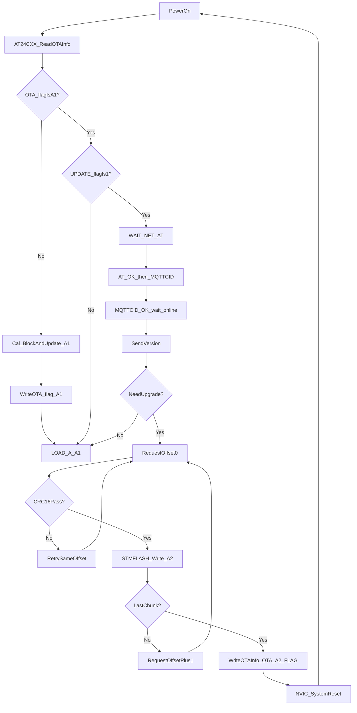

# OTA固件升级流程梳理（基于当前代码）

## 1. 涉及模块与职责

- `USER/main.c`：系统启动、OTA状态机驱动、异常重试与重启策略。
- `HARDWARE/BOOT/boot.c`：复位后判断是否需要将 `A2` 搬运到 `A1`，并执行应用跳转。
- `HARDWARE/GPRS/gprs_rx.c`：接收并解析服务器回复（`version/download`），校验、分包写入、下载完成标志落盘。
- `HARDWARE/GPRS/gprs_tx.c`：发送 `AT`、`MQTTCID`、版本查询、分包下载请求，并缓存最后一次请求用于超时重发。
- `HARDWARE/STMFLASH/stmflash.c`：Flash 读写与按页擦写。
- `HARDWARE/REG/reg.c`：EEPROM 中 OTA 信息读取/默认值写入。
- `HARDWARE/CRC16/crc16.c`：`CRC16_CCITT_FALSE` 包校验。
- `HARDWARE/4G/4G.c`：网络在线信号（`gprsonlineflag`）中断更新。

## 2. 关键数据结构与标志位

### OTA信息（持久化，EEPROM）

`OTA_InfoCB`（`boot.h`）：

- `OTA_flag`：`OTA_A1_FLAG` / `OTA_A2_FLAG`
- `OTA_ver`：当前固件版本字符串
- `OTA_size`：固件总字节数
- `UPDATE_flag`：0 不走联网 OTA，1 走联网 OTA

### 运行时状态

- `SYS_state`（`main.h`）：
  - `OTA_STATE_WAIT_NET` (0)
  - `OTA_STATE_ONLINE` (1)
  - `OTA_STATE_SEND_VERSION` (2)
  - `OTA_STATE_HANDLE_REPLY` (3)
  - `OTA_STATE_REBOOT` (4)
  - `OTA_STATE_AT_OK` (5)
  - `OTA_STATE_MQTTCID_OK` (6)
- `gprsonlineflag`：由 `EXTI9_5_IRQHandler` 根据 `PC5` 上下沿设置网络在线/离线。
- 下载上下文（`gprs_rx.c` 静态变量）：
  - `s_dl_addr`、`s_dl_lastaddr`、`s_dl_last_offset`、`s_dl_crc_retry_cnt`

## 3. 启动到升级完成的主流程

## 4. 详细调用链（按时序）

1. 上电初始化与预处理（`main`）

- `AT24CXX_ReadOTAInfo()` 读取 OTA 元信息。
- `BootLoader_Brance()` 检查 `OTA_flag`，若不是 `OTA_A1_FLAG` 则执行 `A2->A1` 搬运后跳转。
- 若 `OTA_Info.UPDATE_flag != 1`：直接 `LOAD_A(ST32_A1_SADDR)` 跳转 A1。
- 若 `OTA_Info.UPDATE_flag == 1`：进入 OTA 状态机循环。

1. OTA握手阶段（`main` + `gprs_tx.c` + `gprs_rx.c`）

- `WAIT_NET`：周期发送 `At_init()`，接收到 `OK` 返回 `GPRS_RX_RET_AT_OK`。
- `AT_OK`：发送 `CID_init()`，接收到 `+MQTTCID:` 且格式合法后返回 `GPRS_RX_RET_MQTTCID_OK`。
- `MQTTCID_OK`：等待 `gprsonlineflag==1` 进入 `ONLINE`。

1. 版本协商（`cjson_pub_version` / `cjson_upgrade`）

- 客户端发送 `CmdName=version` 请求。
- 服务器回复中 `para.upgrade==1` 且 `version != OTA_Info.OTA_ver` 时：
  - 计算 `OtaParas.count/remaining`。
  - 立即请求 `cjson_pub_getbin(0)`，返回 `GPRS_RX_RET_START_UPDATE`。
- 否则返回 `GPRS_RX_RET_NO_UPDATE`，主流程跳转 A1。

1. 分包下载、CRC校验、A2写入（`cjson_download_reply`）

- 收包格式：`{JSON} + {Size字节bin} + {2字节CRC}`。
- 包长度不足（`Size+2 > message_len`）返回 `GPRS_RX_ERR_PACKET_SHORT`。
- `CRC16_CCITT_FALSE(message, Size)` 与尾部 CRC 比较，不通过时：
  - 同 offset 下最多重试 5 次，请求 `cjson_pub_getbin(Offset)`。
  - 超限返回 `GPRS_RX_ERR_CRC_RETRY_EXCEEDED`。
- CRC通过后：
  - 将字节数换算为 halfword 数，`STMFLASH_Write(s_dl_lastaddr, ...)` 写入 A2。
  - 非最后包请求 `Offset+1`。
  - 最后包：更新 `OTA_Info.OTA_ver/OTA_size/OTA_flag=OTA_A2_FLAG`，写 EEPROM，返回 `GPRS_RX_RET_DOWNLOAD_DONE`。

1. 完成与生效（`main` + `boot.c`）

- `main` 收到 `GPRS_RX_RET_DOWNLOAD_DONE` 后 `NVIC_SystemReset()`。
- 复位后 `BootLoader_Brance()` 发现 `OTA_flag != OTA_A1_FLAG`：
  - `Cal_Block()` 计算块数和尾块大小。
  - `Update_A1()` 从 `ST32_A2_SADDR` 分块读写到 `ST32_A1_SADDR`。
  - 写回 `OTA_flag = OTA_A1_FLAG` 到 EEPROM。
  - `LOAD_A(ST32_A1_SADDR)` 跳转新固件。

## 5. 内存布局与数据路径

- A1 区起始：`ST32_A1_SADDR = 0x0800A000`
- A2 区起始：`ST32_A2_SADDR = 0x0803C000`
- 页大小：`ST32_PAGE_SIZE = 2048`
- OTA下载包大小：`BYTESIZE = 512`
- 接收缓冲：`DMA_Rece_Buf2 -> UART_RX2_BUF(1024)`，JSON 与 bin 同帧解析。

## 6. 当前实现中的失败恢复策略

- 请求超时：`3s` 无数据触发重发最后请求，累计 `5` 次后重启。
- CRC失败：同 offset 下最多 `5` 次，超限后重启。
- 解析/其他错误：错误累计 `5` 次后重启。
- 掉线恢复：离线时将 `SYS_state` 回退到 `WAIT_NET` 并清空请求计数。

## 7. 风险点与改进建议

1. 缺少整包级完整性校验  
当前仅做分包 CRC，建议增加固件全量 CRC/SHA 与签名校验，防止包序正确但整镜像错误。

2. `UPDATE_flag` 触发链需外部保证  
现有代码中默认写参数函数 `paraToEeprom()` 被注释，需确认业务侧何时把 `UPDATE_flag` 置 1。

3. 版本比较为字符串不等  
目前是 `strcmp`，不支持语义版本比较；建议明确版本规则并统一比较策略。

4. A2区下载前未做整区预擦除  
虽然 `STMFLASH_Write` 会按页判断擦写，但中断恢复与残留数据场景建议增加“下载开始时统一清理策略”。

5. 应用跳转合法性检查偏少  
`LOAD_A` 仅检查栈顶范围，建议增加复位向量地址合法性、CRC/签名通过标志联动检查。

6. 包长度上限受缓冲区约束  
当前单帧处理缓冲 `1024` 字节，需确保服务端分包策略与该约束严格一致。
